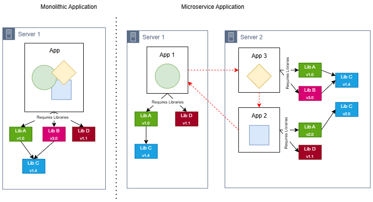
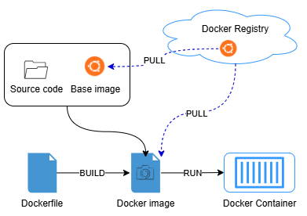

# Kubernetes basic usage learning

## Motivation

I saw many people who want to learn with Kubernetes but they don't have much time for reading a bunch of definitions to understand how it works. Or just because many tutorials focus on the definitions of Kubernetes and they don't have practical examples of deploying an application from End to End

That’s why I created this project—specifically designed for busy individuals who want to grasp the essentials of Kubernetes quickly. My aim is to equip you with a solid foundational understanding of how Kubernetes works and how to leverage it effectively in real-world scenarios.

In this guide, we’ll explore key concepts of Kubernetes through clear, step-by-step examples. My hope is that this resource will empower beginners like you to dive into Kubernetes with confidence.

> For those who wish to deepen their understanding, I highly encourage you to check out the [Kubernetes documentation](https://kubernetes.io/docs/tutorials/)

**! Importants**:

- We won't need in-depth knowledge of Docker usage/mechanism in this guideline, but some basic knowledge of Docker and how to Dockerize applications will be required. You can go to [Docker get started](https://docs.docker.com/get-started/) for a quick review of docker before we can move on

- As you go through this guideline, the explanations may not match 100% with the definitions on the official Documentation, since the target of this project is helping people have the general/basic knowledge of K8s. I've aimed to simplify the content as much as possible to make it easier to understand, and some points are the conclusions draw from my experience

Please let me know if any part of this guideline is incorrect, all contributions are appreciated to make this guideline better

<!-- vim-markdown-toc GFM -->

- [Kubernetes basic usage learning](#kubernetes-basic-usage-learning)
  - [Motivation](#motivation)
  - [Docker - Basic knowledge before we start](#docker---basic-knowledge-before-we-start)
    - [What is Docker](#what-is-docker)
    - [Docker Requirement](#docker-requirement)
    - [Learning Resource](#learning-resource)
  - [Kubernetes](#kubernetes)
    - [What is Kubernetes?](#what-is-kubernetes)
    - [Kubernetes concepts and components](#kubernetes-concepts-and-components)
  - [Physical level](#physical-level)
    - [How to connect to Kubernetes cluster](#how-to-connect-to-kubernetes-cluster)
    - [Simple command to work with Kubernetes Cluster](#simple-command-to-work-with-kubernetes-cluster)
  - [Logical level](#logical-level)
    - [Preparation](#preparation)
    - [Deploy basic application (Deployment, replicaSet, and pod)](#deploy-basic-application-deployment-replicaset-and-pod)
      - [Deployment](#deployment)
        - [Working with Deployment](#working-with-deployment)
        - [Scenarios 1: Scale up the deployment to facilitate more load](#scenarios-1-scale-up-the-deployment-to-facilitate-more-load)
        - [Scenarios 2:  Redeploy the application with Deployment](#scenarios-2--redeploy-the-application-with-deployment)
        - [Scenarios 3: Rollback to Previous Deployment](#scenarios-3-rollback-to-previous-deployment)
        - [Scenarios 4: Test Application with Port-forward](#scenarios-4-test-application-with-port-forward)
      - [ReplicaSet](#replicaset)
        - [Working with ReplicaSet](#working-with-replicaset)
      - [Pod](#pod)
        - [Working with Pods](#working-with-pods)
        - [Scenarios 1: Transfer files between local and Container in Pod](#scenarios-1-transfer-files-between-local-and-container-in-pod)
        - [Scenarios 2: Execute command to container in Pod](#scenarios-2-execute-command-to-container-in-pod)
        - [Scenarios 3: Delete (recreate) a Pod](#scenarios-3-delete-recreate-a-pod)
        - [Scenarios 4: Testing loadbalancing request to Pod](#scenarios-4-testing-loadbalancing-request-to-pod)
    - [Expose application (Service)](#expose-application-service)
      - [ClusterIp - Internal-Only Access](#clusterip---internal-only-access)
      - [Nodeport - Exposing Services on Cluster Nodes](#nodeport---exposing-services-on-cluster-nodes)
      - [Loadbalancer (Cloud)](#loadbalancer-cloud)
      - [Scenarios: Test communicate between Pod in Cluster](#scenarios-test-communicate-between-pod-in-cluster)
    - [Set environment for Aplication on Kubernetes](#set-environment-for-aplication-on-kubernetes)
      - [Option 1: Set environment directly to deployment](#option-1-set-environment-directly-to-deployment)
      - [Option 2: Using Configmap](#option-2-using-configmap)
    - [Cronjob and jobs](#cronjob-and-jobs)
      - [Jobs](#jobs)
      - [Cronjob](#cronjob)
    - [Control project's components in logical level (namespace)](#control-projects-components-in-logical-level-namespace)
      - [Working with namespace](#working-with-namespace)
      - [Scenarios 1: Deploy with different namespace](#scenarios-1-deploy-with-different-namespace)

<!-- vim-markdown-toc -->

## Docker - Basic knowledge before we start

Understanding Docker is essential because Kubernetes runs applications and services as containers. Docker is the most common usage container platform to learn and use, making it the ideal starting point.

In Docker, it's important to first learn how to Dockerize an application and gain hands-on experience in managing and troubleshooting Docker containers. These knowlegede will help a lot when we need to troubleshoot the application issue when deployed in Kubernetes cluster

**Why Do We Use Containers to Deploy Applications?** _(Just a history story, skip if you not interested)_

In the past, most software applications were large and included multiple services or jobs, such as handling external connections (Hub), processing backend logic, or serving frontend pages. These were known as `monolithic` applications.

Monolithic applications typically run as a single process with all components on a handful server, this development system can work but it's hard to scale up and have many potential harmful to the server itself or the company business

For instance:
- Scalability Issues: When a server reaches its capacity, scaling up becomes difficult.
- Troubleshooting Complexity: Identifying the root cause of failures, whether the software issue or hardware related. Narrow down the component that cause issue take time and affect to the up time of services
- And there still have many issues with the security or automating, I haven't mentioned.

As software development evolved, monolithic applications have gradually been replaced by `microservices`, which is smaller, independent and designed to handle specific functions.

Microservices follow an architectural pattern where each service operates independently and communicates via lightweight APIs. This approach offers key advantages:
- **Independent Deployment & Scaling**: Each service can be updated or scaled as needed without affecting the entire application.
- **Improved Fault Isolation**: A failure in one service does not bring down the entire system.
- **Enhanced Flexibility & Agility**: Teams can develop, deploy, and maintain services separately.


The microservice replacing the old architectural (monolithic application) and resolve many problems in architecture and scaling, but with the developing of the product or expanding of business, 
the number of components requires to deploy increases time by time, and it becomes difficult to configure, manage and keep the whole system running smoothly.

And this also bring the complexity on deployment process, since we have to choose the deploying server carefully before deploy to avoid:
- Application requires libraries conflict other Applications on the same server
- Networking between server (or between Application) must secure and open, if network have any issue, it also affect to the application
- If we want to deploy the same application on the new environment, we have to reconfiguration the server again, and this will be a painful for reconfig a project was built for long time ago and some old Libraries isn't exist anymore.

While microservices have replaced monolithic architectures and solved many scalability and architectural issues, there are also have new complexities that we have to handle. As a product grows or a business expands, the number of services increases, making it harder to configure, manage, and maintain the entire system efficiently.

- **Dependency Conflicts**: Different applications running on the same server may require conflicting libraries.
- **Networking Challenges**: Communication between services must be secure and reliable. Any network issue can disrupt applications.
- **Environment Configuration**: Deploying an application in a new environment requires reconfiguring the server. This process can be painful, especially for older projects with outdated libraries that are no longer available.



With these challenges, `Containerize` (Docker) provides a powerful solution by packaging source code along with its dependencies into a standardized unit. This allows applications to be deployed in isolated environments, minimizing dependency conflicts and reducing reliance on the hosting machine.


### What is Docker

> " Docker is an open platform for developing, shipping, and running applications. Docker enables you to separate your applications from your infrastructure so you can deliver software quickly.
>
>   With Docker, you can manage your infrastructure in the same ways you manage your applications. By taking advantage of Docker’s methodologies for shipping, testing, and deploying code quickly, you can significantly reduce the delay between writing code and running it in production."

Docker is an open-source platform that enables containerization, allowing applications to be packaged along with their entire runtime environment, including required libraries and dependencies. This ensures consistency across different deployment environments.

To run an application using Docker:
- The application and its dependencies are packaged into a Docker Image.
- The image is executed in a Docker Container, providing an isolated and consistent runtime.
- Docker images can be stored in a Docker Registry for future use or to be transferred between machines.

This mechanism offers several advantages:
- **Scalable Deployment**: Applications can be deployed across multiple servers simultaneously without reconfiguring hosting environments.
- **Quick Recovery**: If an issue arises, simply restarting the container restores it to its original state, minimizing downtime and business impact.

There are 4 key points related to docker we can focus on:
**Dockerfile**:
- Images are built using a Dockerfile, which specifies a base image and a set of commands to copy source code, install dependencies, and configure the environment.
- Defines the environment, dependencies, and commands needed to run an application.
  Example:
  ```
  FROM node:18  
  WORKDIR /app  
  COPY . .  
  RUN npm install  
  CMD ["node", "server.js"]  
  ```

**Images** :
- A Docker image contains everything required to run a containerized application, including application code, configuration files, environment variables, libraries, and runtime. 
- Images are built using a Dockerfile
- Stored in a registry like Docker Hub or a private registry.

**Containers** :
- A Docker container is a lightweight, virtualized runtime environment that runs an application based on a Docker image.
- Multiple containers can run on a single host, each completely isolated from the host system and other containers.
- Containers can be networked together to communicate with each other or exposed to the host system using ports for external access.

**Registry** :
- A Docker registry is a storage system for Docker images, enabling easy sharing and deployment across different machines.
- Once an image is built, it can be:
  - Run locally on the machine where it was built.
  - Pushed (uploaded) to a registry for future use or distribution.
  - Pulled (downloaded) to another machine and executed.
- Public registries, like Docker Hub, allow access to community and official images, while private registries restrict access to authorized users for security and control.




### Docker Requirement

To follow this guideline, you must have:
- Docker Desktop
  - [Windows](https://docs.docker.com/desktop/setup/install/windows-install/)
  - [Mac](https://docs.docker.com/desktop/setup/install/mac-install/)

- Docker installed for your system check [Linux](https://docs.docker.com/engine/install/)

### Learning Resource

I have created a python application to demonstrate this guideline and I call it [dummy-api](./dummy-api).

If you want to run it directly in your local to know how it's working, please check [dummy-api Readme](./dummy-api/README.md)

In the project, I have created a [Dockerfile](./dummy-api/Dockerfile) which contains steps to build a docker image
  ```
  # The base image 
  FROM python:3.10.1-alpine

  # Install Flask to run this application
  RUN pip install --no-cache-dir Flask    

  # Create working folder
  RUN mkdir /app  

  # Set working dir for the docker container
  WORKDIR /app

  # Copy source code to working folder
  COPY app.py ./
  COPY templates ./templates

  # Just acknowledge this app will be use after
  # Start container from this built image
  EXPOSE 1500

  # Command to run the application
  CMD [ "python", "./app.py" ]
  ```

Then we in the next step I will show how can we dockerize this application to prepare to deploy it to Kubernetes env.
Make sure your Docker server is up and running. Now we will create a Docker image in our local machine.

1. Open terminal and go to folder [dummy-api](./dummy-api)

1. Execute command below:
    ```bash
      docker build -t dummy-api:1 .
    ```

1. When it's finished, we can check created docker image with:
    ```bash
      docker images
    ```

    You will get response like this
    ``` 
      REPOSITORY             TAG             IMAGE ID       CREATED         SIZE
      dummy-api              1               f1060ccb9b7e   6 seconds ago   58.9MB
    ```

**Test running this docker image (Optional)**

Execute command below, it will run your built image as a docker container and we will able to access it

```bash
  docker run -d --name dummy-container -p 1500:1500 dummy-api:1

  # Args explain
  #  -d      : The container will run in background
  #  --name  : Set the name of creating container, will random if we dont set
  #  -p      : Forward internal port of container (left) to external port of our machine (right). Cannot access to container if we dont set

```

Then you can test it by open your browser and navigate to http://localhost:1500

- To view all of your docker container
    ```bash 
      docker ps -a
    ```

- To get the realtime log of the container
    ```bash
      docker logs -f dummy-container
    ```

- To run connect to the container
    ```bash
      docker exec -it dummy-container sh   # Some container have bash shell so we can use "bash" instead of "sh"
    ```

-  To stop the container and all of it changes content still there
    ```bash
      docker stop dummy-container
    ```

- We can start the stopped container again
    ```bash
      docker start dummy-container
    ```

- And remove it, all its contents are removed and it can’t be started again.
    ```bash
      docker rm dummy-container
    ```

> **Note**: The container loaded from your docker image, so if we stop or remove the container it will not affect to the built image.

- To push docker image to Docker Hub or your personal registries
    ```bash
      docker push dummy-api:1
    ```

- In case, you want to remove the docker image on your local machine after testing
```bash
  docker rmi dummy-api:1
```

## Kubernetes

In the previous section, we explored Docker and how containerization simplifies deploying microservices. Docker effectively addresses many software development challenges, providing all the essential tools for building and deploying applications.

However, if Docker solves so much, why do we still need Kubernetes? 

**A Brief Look at Deployment Evolution** _(Just a history story, skip if you not interested)_

Over time, deployment strategies have evolved to address scalability, resource utilization, and management challenges.


- **Traditional deployment** (On-Premise Servers):
    + Applications ran directly on the physical servers and as mentioned in the above session, we will have many potential issues with the server, from libraries conflict between applications to one application can damage all other applications due to crashes or hacks. 
    + Besides, the resource consumption between application isn't defined clearly, which lead to one application can use most of the server resource and all other application would crash or underperforming. 
    + And to avoid those issues, each application must run on a different server, but this solution isn't utilized hardware resources and it causes organizations more money to maintain those servers.

- **Virtualized deployment**:
    To achieve application isolation while optimizing hardware usage, virtualization was introduced.
    + How It Works: A physical server is split into multiple Virtual Machines (VMs), each running its own OS, dependencies, and applications.
    + Benefits: Improved resource allocation, security, and cost efficiency compared to traditional servers.
    + Challenges:
      + Each VM runs a full OS, making provisioning, backup, and management complex.
      + Maintaining and networking multiple VMs requires specialized skills and increases operational challenges.

- **Containers deployment**:
    Containers emerged as a lightweight alternative to VMs, designed to separate software from hardware while maintaining efficiency.
  
    Key Differences from VMs:
    + Containers share the host OS, rather than requiring separate OS installations.
    + Each container holds only the application and necessary libraries, reducing overhead.
    + Containers provide better scalability, efficiency, and faster startup times than VMs.

    As businesses grow, managing containerized applications manually becomes difficult. DevOps teams must:
    + Ensure high availability by monitoring deployments and handling failures.
    + Automate deployments to prevent errors and minimize downtime.
    + Manage server resources efficiently, ensuring enough capacity for new deployments and handling log recycling to avoid disk space issues.

That's how Kubernetes comes to the rescue! Kubernetes provides you with a framework to run distributed systems resiliently.

It takes care of scaling and failover for your application, provides deployment patterns, and more. For example, Kubernetes can easily manage a canary deployment for your system.

### What is Kubernetes?

> "Kubernetes is a portable, extensible, open-source platform for managing containerized workloads and services, that facilitates both declarative configuration and automation. It has a large, rapidly growing ecosystem. Kubernetes services, support, and tools are widely available."

In a simple understanding, Kubernetes (also known as k8s) is an open-source container orchestration platform that automates many of the manual processes involved in deploying, managing, and scaling containerized applications.

Key Benefits of Kubernetes:
- **Automated Deployment & Scaling**: Define configurations using YAML files or commands, making deployments seamless.
- **Self-Healing Mechanism**: Detects and restarts failed containers automatically.
- **Simplifies DevOps Workflows**: Developers can package applications with basic Docker knowledge, while Ops teams focus on managing clusters rather than individual applications.

With Kubernetes, managing containerized applications becomes efficient, reliable, and scalable-eliminating manual intervention in many operational tasks.

### Kubernetes concepts and components

To simplify Kubernetes concepts, let's break it down into two levels:
- **Physical Level**: Covers the hardware components of Kubernetes, including cluster structure, node management, and networking. This helps in understanding how Kubernetes is set up and managed. More related to Ops

- **Logical Level**: Focuses on application deployment within Kubernetes. Here, we’ll explore key components like Pods, Deployments, Services, and how they work together to manage containerized applications. And also all command to help work with Kubernetes

## Physical level

Unlike a traditional single-server management system, Kubernetes operates as a cluster of multiple **connected servers** (at least two). Each server in the cluster is called a node, which can be either a physical or virtual machine.

Kubernetes nodes are categorized into two types:
- **Master Node** (Control Plane): The brain of the cluster, responsible for monitoring, scheduling, and managing workloads. It acts like a virtual system administrator, ensuring the cluster runs smoothly 24/7.

- **eWorker Nodes**: These servers run the actual containerized applications. They receive instructions from the Master Node and execute workloads accordingly.


> Note: In a learning or resource-limited environment, you might have only one node and it will have both roles as Master and Worker

### How to connect to Kubernetes cluster

**Preparation**
To follow this guideline, you must have:
- Docker installed in your machine, check [Docker install](https://docs.docker.com/engine/install/) if you don't have it

- Docker Desktop with Kubernetes activated or Minikube
  - Docker Desktop: Read [Docker Deskop - Kubernetes](https://docs.docker.com/desktop/kubernetes/) for how to enable K8s
  - Minikube: If you don't have kubernetes in your Docker Desktop, then follow [Minikube](https://github.com/kubernetes/minikube) to install it.

To interact with a Kubernetes cluster, you need two essential components:
- **kubectl**:
    A command-line tool that allows you to manage Kubernetes resources, deploy applications, and monitor cluster activities. We can install the Kubectl command in [Kubernetes install tools](https://kubernetes.io/docs/tasks/tools/)

- **Kubeconfig**:
    A configuration file that stores authentication details and access information for the Kubernetes cluster. It acts as a key to securely connect to and interact with the cluster.

    A typical Kubeconfig file follows this structure:

    ```yaml
    apiVersion: v1
    clusters:
    - cluster:
        certificate-authority-data: ... # Certificate of the cluster, this will different for each individual
        server: http://kubernetes.docker.internal:6443       # Cluster url
      name: docker-desktop
    contexts:
    - context:
        cluster: docker-desktop
        user: docker-desktop
      name: docker-desktop
    current-context: docker-desktop
    kind: Config
    preferences: {}
    users:
    - name: docker-desktop
      user:
        client-certificate: ...    # Client cert to authority with Kubernetes
        client-key: ...            # Client key to authority with Kubernetes
    ```

    - By default, kubectl looks for the Kubeconfig file in `$HOME/.kube/config`

    - We also can specify other kubeconfig files by setting the KUBECONFIG environment variable 
    ```bash
      export KUBECONFIG=/path/to/my/kubeconfig
      kubectl cluster-info
    ```
    - Or by setting the --kubeconfig flag.
    ```bash
      kubectl cluster-info --kubeconfig /path/to/my/kubeconfig
    ```

### Simple command to work with Kubernetes Cluster

For the basic, we have serveral command to work with k8s cluster in "physical" way

- To get the cluster infomation
  ```bash
  $ kubectl cluster-info

  # Sample response
  Kubernetes control plane is running at https://kubernetes.docker.internal:6443
  KubeDNS is running at https://kubernetes.docker.internal:6443/api/v1/namespaces/kube-system/services/kube-dns:dns/proxy
  ```

- Check cluster status
  ```bash
  $ kubectl get cs

  # Sample Response
  NAME                 STATUS    MESSAGE             ERROR
  scheduler            Healthy   ok
  controller-manager   Healthy   ok
  etcd-0               Healthy   {"health":"true"}
  ```

- To get all worker nodes of the cluster
  ```bash
  $ kubectl get nodes --show-labels

  # Sample Response
  NAME             STATUS   ROLES    AGE    VERSION   LABELS
  docker-desktop   Ready    master   233d   v1.19.7   beta.kubernetes.io/arch=arm64,beta.kubernetes.io/os=linux,kubernetes.io/arch=arm64,kubernetes.io/hostname=docker-desktop,kubernetes.io/os=linux,node-role.kubernetes.io/master=
  ```

- We aslo can inspect the node information to see the resource usage and pods running on this node
  ```bash
  $ kubectl describe node/[NODE NAME]

  # Sample
  $ kubectl describe node/docker-desktop
  Name:               docker-desktop
  Roles:              control-plane
  Labels:             beta.kubernetes.io/arch=amd64
                      beta.kubernetes.io/os=linux
                      kubernetes.io/arch=amd64
                      kubernetes.io/hostname=docker-desktop
                      kubernetes.io/os=linux
                      node-role.kubernetes.io/control-plane=
                      node.kubernetes.io/exclude-from-external-load-balancers=
  Annotations:        kubeadm.alpha.kubernetes.io/cri-socket: unix:///var/run/cri-dockerd.sock
                      node.alpha.kubernetes.io/ttl: 0
                      volumes.kubernetes.io/controller-managed-attach-detach: true
  CreationTimestamp:  Thu, 13 Feb 2025 15:58:42 +0700
  Taints:             <none>
  Unschedulable:      false
  Lease:
    HolderIdentity:  docker-desktop
    AcquireTime:     <unset>
    RenewTime:       Fri, 07 Mar 2025 16:14:14 +0700
  Conditions:
    Type             Status  LastHeartbeatTime                 LastTransitionTime                Reason                       Message
    ----             ------  -----------------                 ------------------                ------                       -------
    MemoryPressure   False   Fri, 07 Mar 2025 16:14:17 +0700   Thu, 13 Feb 2025 15:58:40 +0700   KubeletHasSufficientMemory   kubelet has sufficient memory available
    DiskPressure     False   Fri, 07 Mar 2025 16:14:17 +0700   Thu, 13 Feb 2025 15:58:40 +0700   KubeletHasNoDiskPressure     kubelet has no disk pressure
    PIDPressure      False   Fri, 07 Mar 2025 16:14:17 +0700   Thu, 13 Feb 2025 15:58:40 +0700   KubeletHasSufficientPID      kubelet has sufficient PID available
    Ready            True    Fri, 07 Mar 2025 16:14:17 +0700   Thu, 13 Feb 2025 15:58:43 +0700   KubeletReady                 kubelet is posting ready status
  Addresses:
    InternalIP:  192.168.65.3
    Hostname:    docker-desktop
  Capacity:
    cpu:                22
    ephemeral-storage:  1055762868Ki
    hugepages-1Gi:      0
    hugepages-2Mi:      0
    memory:             16097212Ki
    pods:               110
  Allocatable:
    cpu:                22
    ephemeral-storage:  972991057538
    hugepages-1Gi:      0
    hugepages-2Mi:      0
    memory:             15994812Ki
    pods:               110
  System Info:
    Machine ID:                 e4860baa-8fb9-4d2d-b78f-2d7c44fa303e
    System UUID:                e4860baa-8fb9-4d2d-b78f-2d7c44fa303e
    Boot ID:                    dbec2d66-564d-485f-b061-25563def3de3
    Kernel Version:             5.15.167.4-microsoft-standard-WSL2
    OS Image:                   Docker Desktop
    Operating System:           linux
    Architecture:               amd64
    Container Runtime Version:  docker://28.0.1
    Kubelet Version:            v1.31.4
    Kube-Proxy Version:         v1.31.4
  Non-terminated Pods:          (9 in total)
    Namespace                   Name                                      CPU Requests  CPU Limits  Memory Requests  Memory Limits  Age
    ---------                   ----                                      ------------  ----------  ---------------  -------------  ---
    kube-system                 coredns-7c65d6cfc9-c5h5s                  100m (0%)     0 (0%)      70Mi (0%)        170Mi (1%)     22d
    kube-system                 coredns-7c65d6cfc9-lkckw                  100m (0%)     0 (0%)      70Mi (0%)        170Mi (1%)     22d
    kube-system                 etcd-docker-desktop                       100m (0%)     0 (0%)      100Mi (0%)       0 (0%)         22d
    kube-system                 kube-apiserver-docker-desktop             250m (1%)     0 (0%)      0 (0%)           0 (0%)         22d
    kube-system                 kube-controller-manager-docker-desktop    200m (0%)     0 (0%)      0 (0%)           0 (0%)         22d
    kube-system                 kube-proxy-746ll                          0 (0%)        0 (0%)      0 (0%)           0 (0%)         22d
    kube-system                 kube-scheduler-docker-desktop             100m (0%)     0 (0%)      0 (0%)           0 (0%)         22d
    kube-system                 storage-provisioner                       0 (0%)        0 (0%)      0 (0%)           0 (0%)         22d
    kube-system                 vpnkit-controller                         0 (0%)        0 (0%)      0 (0%)           0 (0%)         22d
  Allocated resources:
    (Total limits may be over 100 percent, i.e., overcommitted.)
    Resource           Requests    Limits
    --------           --------    ------
    cpu                850m (3%)   0 (0%)
    memory             240Mi (1%)  340Mi (2%)
    ephemeral-storage  0 (0%)      0 (0%)
    hugepages-1Gi      0 (0%)      0 (0%)
    hugepages-2Mi      0 (0%)      0 (0%)
  Events:
    Type     Reason                             Age                From             Message
    ----     ------                             ----               ----             -------
    Normal   Starting                           22d                kube-proxy
    ...
  ```

## Logical level

Kubernetes introduces several components, each with a specific role in deploying and managing containerized applications.

To make learning easier, this guide will walk you through deploying a simple application on Kubernetes, explaining each component step by step.

> **! Important**:
>
>   We will use YAML templates for deployment and kubectl to execute and manage interactions with the cluster.

### Preparation

To follow this guideline, you must have:
- Docker installed in your machine, check [Docker install](https://docs.docker.com/engine/install/) if you don't have it

- Docker Desktop with Kubernetes activated or Minikube
  - Docker Desktop: Read [Docker Deskop - Kubernetes](https://docs.docker.com/desktop/kubernetes/) for how to enable K8s
  - Minikube: If you don't have kubernetes in your Docker Desktop, then follow [Minikube](https://github.com/kubernetes/minikube) to install it.

To interact with a Kubernetes cluster, you need two essential components:
- **kubectl**:
    A command-line tool that allows you to manage Kubernetes resources, deploy applications, and monitor cluster activities. We can install the Kubectl command in [Kubernetes install tools](https://kubernetes.io/docs/tasks/tools/)

>**! Important**:
>
>   Make sure you have followed [Docker#learning-resource](#learning-resource) and dockerize the dummy-api application first

### Deploy basic application (Deployment, replicaSet, and pod)

At this point, let's assume:
- You have access to a Kubernetes cluster, or Kubernetes is set up and running locally.
- We have already built a Docker image for the Dummy-api application, in the above example

Now, we can begin deploying our application to Kubernetes.

Before deployment, we need a YAML template to guide Kubernetes on how to deploy our application.

> I have prepared the deployment template for us to use on this sample, [./kubernetes/deployments/deployment.yaml](./kubernetes/deployments/deployment.yaml)
```yaml
apiVersion: apps/v1                      # Api version of Kubernetes
kind: Deployment                         # Resource usage  
metadata:                                # Deployment information
  name: dummy-api
  labels:
    app: demo
spec:                                    # Deployment content
  replicas: 1                            # Number of containers will create
  selector:
    matchLabels:
      app: demo
  template:                              # Template information for the container
    metadata:
      labels:
        app: demo
    spec:
      containers:
      - name: demo-container             # Container name after deploy
        image: dummy-api:1               # Image usage
        imagePullPolicy: IfNotPresent    # By default it's "Always" but for local env I use this for saving time
        ports:                           # Port of container
        - containerPort: 1500
```

Then execute command to deploy this to Kubernetes cluster
```bash
$ kubectl apply -f kubernetes/deployments/deployment.yaml

# Sample response
deployment.apps/dummy-api created
```

With the same sample response on your terminal, which means your application has been deployed to the Kubernetes cluster

To check the deployed deployment, you can run the command:
```bash
$ kubectl get deployment

# Sample response
NAME        READY   UP-TO-DATE   AVAILABLE   AGE
dummy-api   1/1     1            1           10s
```

That's it! Simple as that. 🚀

**But what exactly happening in Kubernetes**:

When deploying your application in Kubernetes, it’s not as simple as just placing it on any server. The process involves three key components:
- **Deployment**: Defines how your application should be managed and updated.
- **ReplicaSet**: Ensures the desired number of instances (Pods) are running.
- **Pods**: The smallest deployable unit, containing your application’s container(s).


> We will explore each one of them in below sessions

#### Deployment

When you trigger the deployment command, the Deployment resource is created.

A Deployment in Kubernetes manages the lifecycle of your application, controlling how it is created, updated, and maintained. It ensures that your application runs reliably with features like:
- Replica management: Defines how many instances (Pods) of your application should be running.
- Rolling updates & rollback: Enables seamless updates with minimal downtime and the ability to revert if needed.

> **Did You Know?**
>
> One common Kubernetes deployment strategy is Blue/Green Deployment:
>
>-  The Green environment hosts the current application and serves user traffic.
>- The Blue environment contains the new application version but is not yet live.
>
>After successful health checks, Kubernetes switches traffic to Blue, making it live, and decommissions Green to free up resources. This approach minimizes downtime and ensures a smooth update process.

##### Working with Deployment

- **Get/List all deployments**:
```bash
$ kubectl get deployment

# Sample response
NAME        READY   UP-TO-DATE   AVAILABLE   AGE
dummy-api   1/1     1            1           10s
```

- **Get deployment status**:
```bash
$ kubectl rollout status deployment/[DEPLOYMENT NAME]

# Sample 
$ kubectl rollout status deployment/dummy-api
deployment "dummy-api" successfully rolled out
```

If you get the same response which means your deployment has been successfully deployed

- **Get Deployment information**:
```bash
$ kubectl describe deployment/[DEPLOYMENT NAME]

# Sample
$ kubectl describe deployment/dummy-api
Name:                   dummy-api
Namespace:              default
CreationTimestamp:      Fri, 07 Mar 2025 16:50:20 +0700
Labels:                 app=demo
                        version=1
Annotations:            deployment.kubernetes.io/revision: 1
Selector:               app=demo
Replicas:               1 desired | 1 updated | 1 total | 1 available | 0 unavailable
StrategyType:           RollingUpdate
MinReadySeconds:        0
RollingUpdateStrategy:  25% max unavailable, 25% max surge
Pod Template:
  Labels:  app=demo
  Containers:
   demo-container:
    Image:        dummy-api:1
    Port:         1500/TCP
    Host Port:    0/TCP
    Environment:  <none>
    Mounts:       <none>
  Volumes:        <none>
Conditions:
  Type           Status  Reason
  ----           ------  ------
  Available      True    MinimumReplicasAvailable
  Progressing    True    NewReplicaSetAvailable
OldReplicaSets:  <none>
NewReplicaSet:   dummy-api-55b48f6c47 (1/1 replicas created)
Events:
  Type    Reason             Age    From                   Message
  ----    ------             ----   ----                   -------
  Normal  ScalingReplicaSet  3m10s  deployment-controller  Scaled up replica set dummy-api-55b48f6c47 to 1
```

> **! Tips**:
> 
> Sometimes you will your application isn't live but the message shows the deployment has been successfully deployed.
> To diagnose the issue, check the "Events" in the Deployment resource. Events provide detailed insights into potential problems, such as scheduling failures, insufficient resources, or container startup issues.

- **Delete the deployment**:

We can delete the deployment based on the template with command:
```bash
$ kubectl delete -f kubernetes/deployments/deployment.yaml
```

Or we can direct delete the deployment with it name
```bash
$ kubectl delete deployment/[DEPLOYMENT NAME]

# Sample
$ kubectl delete deployment/dummy-api
```

##### Scenarios 1: Scale up the deployment to facilitate more load

We can scale up the number of running container(s) on Kubernetes to help avoid overload in the container.
```bash
$ kubectl scale deployment/[DEPLOYMENT NAME] --replicas=[NUM]

# Sample response
$ kubectl scale deployment/dummy-api --replicas=2
deployment.apps/dummy-api scaled
```

then we can check the deployment again for the changes
```bash
$ kubectl get deployment

# Sample response
NAME        READY   UP-TO-DATE   AVAILABLE   AGE
dummy-api   2/2     2            2           30m
```

##### Scenarios 2:  Redeploy the application with Deployment

When we want to redeploy the application with the new version, we just need to use the old deployment template and replace it with the new docker image version.

  1. I will retag the docker image of Dummy-api to pretend this is the new version of Dummy-api
      ```bash
      $ docker tag dummy-api:1 dummy-api:2
      ```

  1. Then we will change the deployment template for the new version of application.

      For this sample, I have prepared another deployment template [kubernetes/deployments/deployment-v2.yaml](./kubernetes/deployments/deployment-v2.yaml)
      ```yaml
      apiVersion: apps/v1
      kind: Deployment
      metadata:
        name: dummy-api
        labels:
          app: demo
      spec:
        replicas: 1
        selector:
          matchLabels:
            app: demo
        template:
          metadata:
            labels:
              app: demo
          spec:
            containers:
            - name: demo-container
              image: dummy-api:2              # Updated new docker image version
              imagePullPolicy: IfNotPresent
              ports:
              - containerPort: 1500
      ```

  1. Start deploying this template to Kubernetes cluster
      ```bash
      $ kubectl apply -f deployment-v2.yaml

      # Sample response
      deployment.apps/dummy-api configured
      ```

  1. We can get the deployment information for the new updates
      ```bash
      $ kubectl describe deployment/dummy-api

      # Sample response
      Name:                   dummy-api
      Namespace:              default
      CreationTimestamp:      Fri, 07 Mar 2025 16:54:19 +0700
      Labels:                 app=demo
      Annotations:            deployment.kubernetes.io/revision: 2
      Selector:               app=demo
      Replicas:               1 desired | 1 updated | 1 total | 1 available | 0 unavailable
      StrategyType:           RollingUpdate
      MinReadySeconds:        0
      RollingUpdateStrategy:  25% max unavailable, 25% max surge
      Pod Template:
        Labels:  app=demo
        Containers:
         demo-container:
          Image:        dummy-api:2
          Port:         1500/TCP
          Host Port:    0/TCP
          Environment:  <none>
          Mounts:       <none>
        Volumes:        <none>
      Conditions:
        Type           Status  Reason
        ----           ------  ------
        Available      True    MinimumReplicasAvailable
        Progressing    True    NewReplicaSetAvailable
      OldReplicaSets:  <none>
      NewReplicaSet:   dummy-api-5b599c48c6 (1/1 replicas created)
      Events:
        Type    Reason             Age   From                   Message
        ----    ------             ----  ----                   -------
        Normal  ScalingReplicaSet  48m   deployment-controller  Scaled up replica set dummy-api-55b48f6c47 to 1
        ...
      ```

##### Scenarios 3: Rollback to Previous Deployment

- **Get Deployment history**:
```bash
$ kubectl rollout history deployment/[DEPLOYMENT NAME]

# Sample 
$ kubectl rollout history deployment/dummy-api
deployment.apps/dummy-api
REVISION  CHANGE-CAUSE
1         <none>
2         <none>
```

`CHANGE-CAUSE` is copied from the Deployment annotation "kubernetes.io/change-cause", and we can set it for each deployment.

And to view the detail of each revision:
```bash
$ kubectl rollout history deployment/[DEPLOYMENT NAME] --revision=[NUM]

# Sample
$ kubectl rollout history deployment/dummy-api --revision=2
deployment.apps/dummy-api with revision #2
Pod Template:
  Labels:	app=demo
	pod-template-hash=5b599c48c6
  Containers:
   demo-container:
    Image:	dummy-api:2
    Port:	1500/TCP
    Host Port:	0/TCP
    Environment:	<none>
    Mounts:	<none>
  Volumes:	<none>
```

- **Rolling Back to a Previous Revision**:
```bash
$ kubectl rollout undo deployment/[DEPLOYMENT NAME] --to-revision=[NUM]

# Sample
$ kubectl rollout undo deployment/dummy-api --to-revision=1
deployment.apps/dummy-api rolled back
```

Then we can inspect the deployment to check it
```bash
$ kubectl describe deployment/dummy-api

# Sample response
Name:                   dummy-api
Namespace:              default
CreationTimestamp:      Fri, 07 Mar 2025 16:55:02 +0700
Labels:                 app=demo
Annotations:            deployment.kubernetes.io/revision: 4
Selector:               app=demo
Replicas:               2 desired | 2 updated | 2 total | 2 available | 0 unavailable
StrategyType:           RollingUpdate
MinReadySeconds:        0
RollingUpdateStrategy:  25% max unavailable, 25% max surge
Pod Template:
  Labels:  app=demo
  Containers:
   demo-container:
    Image:        dummy-api:1
    Port:         1500/TCP
    Host Port:    0/TCP
    Environment:  <none>
    Mounts:       <none>
  Volumes:        <none>
Conditions:
  Type           Status  Reason
  ----           ------  ------
  Available      True    MinimumReplicasAvailable
  Progressing    True    NewReplicaSetAvailable
OldReplicaSets:  <none>
NewReplicaSet:   dummy-api-55b48f6c47 (2/2 replicas created)
Events:
  Type    Reason             Age                  From                   Message
  ----    ------             ----                 ----                   -------
  Normal  ScalingReplicaSet  7m53s                deployment-controller  Scaled up replica set dummy-api-5b599c48c6 to 2
  ...
```

As we saw, the `Image` has swapped to `dummy-api:1` which is dedicated to the first deployment

##### Scenarios 4: Test Application with Port-forward

Right now, the deployed application is not accessible from anywhere.
If you try accessing `http://localhost:1500`, it won’t work.

To make the application available, we need to expose it using a Service, which we’ll cover in [Expose application (Service)](#expose-application-service)

However, for debugging purposes, you can temporarily test the application using the following command:
```bash
$ kubectl port-forward deployment/dummy-api 1500:1500

# Sample response
Forwarding from 127.0.0.1:1500 -> 1500
Forwarding from [::1]:1500 -> 1500
```

Then we can access our application via url `http://localhost:1500`

```bash
$ curl http://localhost:1500/ping
pong!%
```

#### ReplicaSet

The Deployment resource focuses on managing the lifecycle of an application. Each time a new deployment is executed, a ReplicaSet is created.

Role of ReplicaSet:
- Ensures the specified number of Pods are running at all times.
- Maintains stability when scaling the deployment.
- Multiple ReplicaSets may exist for different deployed versions, but all are controlled by a single Deployment resource.

> **! Important**:
> While ReplicaSet guarantees that a certain number of pods are always running, Deployment is a higher-level abstraction that manages ReplicaSets and provides features like rolling updates and rollbacks.
>
> It is recommended to use Deployments instead of directly managing ReplicaSets, unless you need custom update orchestration or do not require updates at all.

##### Working with ReplicaSet

- **Get replicaSet**:
```bash
$ kubectl get rs

# Sample response
NAME                   DESIRED   CURRENT   READY   AGE
dummy-api-55b48f6c47   0         0         0       3h17m    # This is the deploy of dummy-api version 1
dummy-api-5b599c48c6   1         1         1       149m     # The new update for dummy-api version 2 (last exsample)
```

- **Get replicaSet information**:
```bash
$ kubectl describe rs/[REPLICASET NAME]

# Sample
$ kubectl describe rs/dummy-api-5b599c48c6
Name:           dummy-api-5b599c48c6
Namespace:      default
Selector:       app=demo,pod-template-hash=5b599c48c6
Labels:         app=demo
                pod-template-hash=5b599c48c6
Annotations:    deployment.kubernetes.io/desired-replicas: 1
                deployment.kubernetes.io/max-replicas: 2
                deployment.kubernetes.io/revision: 2
Controlled By:  Deployment/dummy-api
Replicas:       1 current / 1 desired
Pods Status:    1 Running / 0 Waiting / 0 Succeeded / 0 Failed
Pod Template:
  Labels:  app=demo
           pod-template-hash=5b599c48c6
  Containers:
   demo-container:
    Image:        dummy-api:2
    Port:         1500/TCP
    Host Port:    0/TCP
    Environment:  <none>
    Mounts:       <none>
  Volumes:        <none>
Events:           <none>
```

> **! Note**:
>
>    Since ReplicaSet will be created automatically when deployed the Deployment, the ReplicaSet will have the randomized name with the prefix is the name of Deployment

#### Pod

A Pod is the smallest deployable unit in Kubernetes, responsible for managing container(s).

**Key Points About Pods**
- A Pod can contain multiple containers, but best practice recommends one container per Pod for better isolation and scalability.
- When created, a Pod can be scheduled on any node in the cluster by default.
- We can specify configurations in the Deployment template to assign Pods to specific nodes.

**Why is this important?**
- Kubernetes balances Pods across worker nodes to optimize resource usage.
- If a node fails, Kubernetes automatically reschedules Pods to healthy nodes, ensuring high availability.

##### Working with Pods

A Pod in Kubernetes can be treated like a Docker container, as it provides a similar isolated runtime environment. Most actions you perform on a Docker container can also be done with a Pod.

- **Get/List all Pods**:
```bash
$ kubectl get pods

# Sample response
NAME                         READY   STATUS    RESTARTS   AGE
dummy-api-55b48f6c47-dr24c   1/1     Running   0          51m
```

- **Inspect Pod Information**:
```bash
$ kubectl describe pod/[POD NAME]

# Sample
$ kubectl describe pod/dummy-api-55b48f6c47-nfx8n
Name:         dummy-api-55b48f6c47-nfx8n
Namespace:    default
Priority:     0
Node:         docker-desktop/192.168.65.4
Start Time:   Fri, 07 Mar 2025 16:50:25 +0700
Labels:       app=demo
              pod-template-hash=55b48f6c47
Annotations:  <none>
Status:       Running
IP:           10.1.3.181
IPs:
  IP:           10.1.3.181
Controlled By:  ReplicaSet/dummy-api-55b48f6c47
Containers:
  demo-container:
    Container ID:   docker://234b5139b416b707f4b8c94d9d01a7185ef836f963c40c171cfe1e36ba993a66
    Image:          dummy-api:1
    Image ID:       docker://sha256:b749b81b8b69783ee483865099cce56996e1ae009dbf0c6d8051f73c9e1e43b4
    Port:           1500/TCP
    Host Port:      0/TCP
    State:          Running
      Started:      Fri, 07 Mar 2025 16:50:26 +0700
    Ready:          True
    Restart Count:  0
    Environment:    <none>
    Mounts:
      /var/run/secrets/kubernetes.io/serviceaccount from default-token-47xb9 (ro)
Conditions:
  Type              Status
  Initialized       True
  Ready             True
  ContainersReady   True
  PodScheduled      True
Volumes:
  default-token-47xb9:
    Type:        Secret (a volume populated by a Secret)
    SecretName:  default-token-47xb9
    Optional:    false
QoS Class:       BestEffort
Node-Selectors:  <none>
Tolerations:     node.kubernetes.io/not-ready:NoExecute op=Exists for 300s
                 node.kubernetes.io/unreachable:NoExecute op=Exists for 300s
Events:
  Type    Reason     Age   From               Message
  ----    ------     ----  ----               -------
  Normal  Scheduled  54m   default-scheduler  Successfully assigned default/dummy-api-55b48f6c47-nfx8n to docker-desktop
  Normal  Pulled     54m   kubelet            Container image "dummy-api:1" already present on machine
  Normal  Created    54m   kubelet            Created container demo-container
  Normal  Started    54m   kubelet            Started container demo-container
```

- **Get Log of container in Pod**:
```bash
$ kubectl logs [POD NAME]

# Sample
$ kubectl logs dummy-api-55b48f6c47-nfx8n
 * Serving Flask app 'app' (lazy loading)
 * Environment: development
 * Debug mode: on
 * Running on all addresses.
   WARNING: This is a development server. Do not use it in a production deployment.
 * Running on http://10.1.3.181:1500/ (Press CTRL+C to quit)
 * Restarting with stat
 * Debugger is active!
 * Debugger PIN: 130-396-372
127.0.0.1 - - [07/Mar/2025 16:50:29] "GET / HTTP/1.1" 200 -
127.0.0.1 - - [07/Mar/2025 16:50:29] "GET /favicon.ico HTTP/1.1" 404 -
127.0.0.1 - - [07/Mar/2025 16:50:35] "GET /ping HTTP/1.1" 200 -
```

If we want to stream the logs realtime, you can add the flag `-f` in the command


##### Scenarios 1: Transfer files between local and Container in Pod

- To copy file to container in pod
```bash
$ kubectl cp [FILE TO COPY] [POD NAME]:[DESTINATION]

# Sample
$ kubectl cp test.txt dummy-api-55b48f6c47-nfx8n:/tmp/
```

- To download file from container in pod
```bash
$ kubectl cp [POD NAME]:[FILE TO COPY] [DESTINATION]

# Sample
$ kubectl cp dummy-api-55b48f6c47-nfx8n:/tmp/test.txt .
```

##### Scenarios 2: Execute command to container in Pod

- To execute a simple command to container in pod
```bash
$ kubectl exec [POD NAME] -- [COMMAND]

# Sample
$ kubectl exec dummy-api-55b48f6c47-dr24c -- date
Mon Jan 10 14:23:50 UTC 2022
```

- To connect to container in pod
```bash
$ kubectl exec -it [POD NAME] -- sh -il

# Sample Command
$ kubectl exec -it dummy-api-55b48f6c47-dr24c -- sh -il
```

##### Scenarios 3: Delete (recreate) a Pod

We can delete the pod, but because we have the `ReplicaSet` to control the number of Pods for each Deployment.
So when we delete the pod, it will delete the target pod but also create a new pod to maintain the number of pods defined in ReplicaSet

```bash
$ kubectl delete pods/[POD NAME]

# Sample response
$ kubectl delete pods/dummy-api-55b48f6c47-dr24c
pod "dummy-api-55b48f6c47-dr24c" deleted
```

When we check the list pods again
```bash
$ kubectl get pods

# Sample response
NAME                         READY   STATUS    RESTARTS   AGE
dummy-api-55b48f6c47-nfx8n   1/1     Running   0          80m
dummy-api-55b48f6c47-z6htv   1/1     Running   0          2s
```

##### Scenarios 4: Testing loadbalancing request to Pod

When an end-user sends a request to our application, Kubernetes automatically load balances the incoming traffic between available Pods.

- **Example**:

To prove the felexibily of the pod, we can scale up the above sample to 2 with command:
```bash
$ kubectl scale deployment/dummy-api --replicas=2
```

Next, expose the pod to your local machine, just run the script.
```bash
$ kubectl apply -f service/service-nodeport.yaml
# For more details on the script, we will explain it in the next session
```

Then we will open the browser and access to our application via url http://localhost:3000, you can try reload the page a few time and pay attention to the `Host name`.

You may see it's changed based on the pod name.

### Expose application (Service)

By default, Pods cannot be accessed outside the cluster. While we can use `kubectl port-forward` for development, it's not suitable for production.

To expose an application to external traffic in a Kubernetes cluster, we use a Service resource Kubernetes provides three main types of Services to expose applications:
- ClusterIP (Default):
    - Exposes the application internally within the cluster.
    - Useful for communication between microservices.
    - Cannot be accessed externally.
- NodePort
    - Exposes the application on a static port on each node.
    - External users can access it using `<NodeIP>`:`<NodePort>`.
    - Not recommended for production due to limited scalability.
- LoadBalancer
    - Automatically provisions an external load balancer (in cloud environments).
    - Best for public-facing applications.
    - Requires a cloud provider like AWS, GCP, or Azure.

#### ClusterIp - Internal-Only Access

ClusterIP is the default Kubernetes Service type. It exposes a service only within the cluster, making it accessible to other applications but not externally.
Use Case:
  - Ideal for microservices that communicate internally.
  - Not accessible from outside the cluster.


> Note: If you have delete the deployment, refer to the [#deployment](#deployment) to redeploy the dummy-api application

To deploy the ClusterIP service we will use the template [service-clusterip.yaml](./kubernetes/services/service-clusterip.yaml)
```yaml
apiVersion: v1
kind: Service
metadata:
  name: dummy                 # Name of the service
  labels:
    app: demo
spec:                         # Service expose information
  selector:
    app: demo
  ports:
    - protocol: TCP
      port: 1500               # Application port inside container
      targetPort: 1500         # Expose to the cluster internal network with port
```

Then we will deploy this service to kubernetes cluster
```bash
$ kubectl apply -f kubernetes/services/service-clusterip.yaml

# Sample response
service/dummy created
```

We can list the service
```bash
$ kubectl get service

# Sample response
NAME         TYPE        CLUSTER-IP     EXTERNAL-IP   PORT(S)   AGE
dummy        ClusterIP   10.97.23.218   <none>        1500/TCP   9s
```

#### Nodeport - Exposing Services on Cluster Nodes

A NodePort service exposes an application on a specific port across all nodes in a Kubernetes cluster. Kubernetes routes external traffic hitting this port to the service, even if the pod is not running on that particular node.

Key Points:
- Opens a static port (30000-32767) on every node.
- Routes external requests to the correct service.
- Each NodePort is dedicated to a single service.


> Note: If you have delete the deployment, refer to the [#deployment](#deployment) to redeploy the dummy-api application

To deploy the NodePort service we will use the template [service-nodeport.yaml](./kubernetes/services/service-nodeport.yaml)
```yaml
apiVersion: v1
kind: Service
metadata:
  name: dummy                 # Name of the service
  labels:
    app: demo
spec:                         # Service expose information
  type: NodePort              # Specify the service type
  selector:
    app: demo
  ports:
    - protocol: TCP
      port: 1500               # Application port inside container
      targetPort: 1500         # Expose to the cluster internal network with port
      nodePort: 30000         # Specify the node port to connect outside the cluster
```

We can specify a fixed port for a NodePort service using the nodePort field in the YAML template. However, if we don't define it, Kubernetes will automatically assign a random port within the `30000-32767` range for each deployment.

Then we will deploy this service to kubernetes cluster
```bash
$ kubectl apply -f kubernetes/services/service-nodeport.yaml

# Sample response
service/dummy created
```

We can list the service
```bash
$ kubectl get service

# Sample response
NAME         TYPE        CLUSTER-IP     EXTERNAL-IP   PORT(S)   AGE
dummy        NodePort    10.101.187.44   <none>        1500:30000/TCP   11s
```

- **Test connect to Dummy-api through NodePort service (Optional)**

On your local machine, execute command below:
```bash
$ curl http://localhost:30000/ping

# Sample response
pong!%
```

or we can access to url `http://localhost:30000` to view the UI

#### Loadbalancer (Cloud)

The LoadBalancer service type is specifically designed for cloud environments that support external load balancers.

When using this service type, Kubernetes automatically provisions an external load balancer through the cloud provider, assigning it a publicly accessible URL or IP address. This makes it easy to expose services to the internet without additional configuration.

✅ Best for: Production environments on cloud platforms like AWS, GCP, and Azure.
⚠️ Note: Requires a cloud provider that supports external load balancers.


> Note: If you have delete the deployment, refer to the [#deployment](#deployment) to redeploy the dummy-api application

To Deploy the Loadbalancer service, we will use the template [service-loadbalancer.yaml](./kubernetes/services/service-loadbalance.yaml)
```yaml
apiVersion: v1
kind: Service
metadata:
  name: dummy
  labels:
    app: demo
spec:
  type: Loadbalancer
  selector:
    app: demo
  ports:
    - protocol: TCP
      port: 1500
      targetPort: 1500
```

Just need to deploy this service to Kubernetes cluster
```bash
$ kubectl apply -f kubernetes/services/service-loadbalance.yaml

# Sample response
service/dummy created
```

When we get the service we can have reponse like that
```bash
$ kubectl get service

# Sample response
NAME            TYPE           CLUSTER-IP       EXTERNAL-IP                                                             PORT(S)                             AGE
dummy           LoadBalancer   10.20.240.237    a57b64b7xxxxxxxxxxxxxxxxxxxxxxxx-xxxxxxxx.us-west-2.elb.amazonaws.com   1500:31469/TCP                       35s
```

Then we just need to set the loadbalancer url `a57b64b7xxxxxxxxxxxxxxxxxxxxxxxx-xxxxxxxx.us-west-2.elb.amazonaws.com` to DNS for user to access

#### Scenarios: Test communicate between Pod in Cluster

First let assumed we already have at least one of three services type deployed for the Dummy api

  1. We will run another pod to test
  ```bash
  $ kubectl run --rm curl --image=radial/busyboxplus:curl -i --tty

  # Sample response
  If you don't see a command prompt, try pressing enter.
  [ root@curl:/ ]$
  ```

At this point, we already create another pod to the CLuster and we will try to call the Dummy-Api application through this Pod

  1. We just simple call the service name of the Dummy-Api application to connect to it, in this case is `dummy`:
  ```bash
  $ curl http://dummy:1500/ping

  # Sample response
  pong!%
  ```

This means your Dummy-api application is now visible with other Pods in the Kubernetes cluster.

We also can try remove the service of Dummy api and run the command above again to see what happened when we don't have the Service resource

### Set environment for Aplication on Kubernetes

There is two ways we can set the environment variable to the container in K8s

#### Option 1: Set environment directly to deployment

In the deployment template, we can specify the component:
```yaml
...
  env:
    - name: VARIABLE_NAME
      value: "Value of variable"
```

For this example, we have a deployment template [kubernetes/environment/deployment-env.yaml](./kubernetes/environment/deployment-env.yaml)
```yaml
apiVersion: apps/v1
kind: Deployment
metadata:
  name: dummy-api
  labels:
    app: demo
spec:
  replicas: 1
  selector:
    matchLabels:
      app: demo
  template:
    metadata:
      labels:
        app: demo
    spec:
      containers:
        - name: demo-container
          image: dummy-api:1
          imagePullPolicy: IfNotPresent
          ports:
            - containerPort: 1500
          env:                               # Update the environment for this deployment
            - name: GREETING_QUOTE
              value: "Deployment with direct environment variable"
```

Then we will execute deployment command
```bash
$ kubectl apply -f kubernetes/environment/deployment-env.yaml

# Sample response
deployment.apps/dummy-api configured
```

We can inspect the new deployment information
```bash
$ kubectl describe deployment/dummy-api

# Sample response
Name:                   dummy-api
Namespace:              default
CreationTimestamp:      Fri, 07 Mar 2025 18:10:06 +0700
Labels:                 app=demo
Annotations:            deployment.kubernetes.io/revision: 5
Selector:               app=demo
Replicas:               1 desired | 1 updated | 1 total | 1 available | 0 unavailable
StrategyType:           RollingUpdate
MinReadySeconds:        0
RollingUpdateStrategy:  25% max unavailable, 25% max surge
Pod Template:
  Labels:  app=demo
  Containers:
   demo-container:
    Image:      dummy-api:1
    Port:       1500/TCP
    Host Port:  0/TCP
    Environment:
      GREETING_QUOTE:  Deployment with direct environment variable
    Mounts:            <none>
  Volumes:             <none>
Conditions:
  Type           Status  Reason
  ----           ------  ------
  Available      True    MinimumReplicasAvailable
  Progressing    True    NewReplicaSetAvailable
OldReplicaSets:  <none>
NewReplicaSet:   dummy-api-6c674cd646 (1/1 replicas created)
Events:
  Type    Reason             Age   From                   Message
  ----    ------             ----  ----                   -------
  Normal  ScalingReplicaSet  32s   deployment-controller  Scaled down replica set dummy-api-55b48f6c47 to 1
  ...
```

As we can see the `Containers` has updated with the `Environment`.

- If we connect to the container and execute command `env`, we can see our environment
```bash
$ kubectl exec -it dummy-api-6c674cd646-hdqpvv -- sh -il

$ dummy-api-6c674cd646-hdqpv:/app# env | grep GREET
GREETING_QUOTE=Deployment with direct environment variable
```

- We can also connect to the application via Url http://localhost:30000 and saw the changes of the quote
  
  We may need to deploy the Service to expose the Dummy-api 
  ```bash
  $ kubectl deploy -f kubernetes/services/service-nodeport.yaml
  ```

#### Option 2: Using Configmap

Configmap is used to store non-confidential data in key-value pairs. Pods can consume ConfigMaps as environment variables, command-line arguments, or as configuration files in a volume.

A ConfigMap allows you to decouple environment-specific configuration from your container images, so that your applications are easily portable.

- **Deploy a configmap**:

Similar with other resource, configmap also have a deploy template, for this example we will use resource in folder [./kubernetes/environment/configmap-env](./kubernetes/environment/configmap-env) and the sample configmap template
```yaml
apiVersion: v1
kind: ConfigMap             # Resource type
metadata:
  name: dummy-config        # Configmap name
data:                       # Variables
  GREETING_QUOTE: "Load configmap as environment variable"
```

Deploy the configmap to Kubernetes cluster
```bash
$ kubectl apply -f kubernetes/environment/configmap-env/configmap.yaml

# Sample response
configmap/dummy-config created
```

Then we can get the configmap with:
```bash
$ kubectl get configmap

# Sample response
NAME           DATA   AGE
dummy-config   1      23s
```

Get the configmap detail
```bash
$ kubectl describe configmap/dummy-config

# Sample response
Name:         dummy-config
Namespace:    default
Labels:       <none>
Annotations:  <none>

Data
====
GREETING_QUOTE:
----
Load configmap as environment variable

BinaryData
====

Events:  <none>
```

Right now the Pod (container) in Deployment isn't use this configmap.
To make it work we will need the component:
```yaml
...
  envFrom:
  - configMapRef:
      name: dummy-config
```

For this example, we have a deployment template [deployment.yaml](./kubernetes/environment/configmap-env/deployment.yaml)
```yaml
apiVersion: apps/v1
kind: Deployment
metadata:
  name: dummy-api
  labels:
    app: demo
spec:
  replicas: 1
  selector:
    matchLabels:
      app: demo
  template:
    metadata:
      labels:
        app: demo
    spec:
      containers:
      - name: demo-container
        image: dummy-api:1
        imagePullPolicy: IfNotPresent
        ports:
        - containerPort: 1500
        envFrom:                           # Here is the place to use this
        - configMapRef:
            name: dummy-config             # Must match the Configmap name
```

Apply this Deployment template to Kubernetes
```bash
$ kubectl apply -f ./kubernetes/environment/configmap-env/deployment.yaml
```

Then we can check the environment of the created Pod or access url http://localhost:30000 to see the quote changed

- **Clean up**:

We can delete the configmap with template 
```bash
$ kubectl delete -f ./kubernetes/environment/configmap-env/configmap.yaml
```

Or directly in command
```bash
$ kubectl delete configmap/dummy-api
```

### Cronjob and jobs

Kubernetes supports both long-running and short-lived workloads. While most applications handle continuous traffic, some tasks are executed once or on a recurring schedule. Kubernetes provides Jobs and CronJobs to manage these workloads efficiently.
- Jobs are tasks that execute some logic once, each job will create a dedicated Pod to execute task(s) and everything will be destroyed after task(s) finished
- CronJobs is the controller of Jobs that a single job is repeated following a Cron pattern.

#### Jobs

For this sample, we will work on folder [kubernetes/cronjob](./kubernetes/cronjob)
A Job will have the deployment template [job.yaml](./kubernetes/cronjob/job.yaml)
```yaml
apiVersion: batch/v1
kind: Job
metadata:
  generateName: job-               # The name will dynamic with prefix "job-"
spec:
  template:
    spec:                          # Pod information
      containers:
      - name: hello
        image: busybox
        imagePullPolicy: IfNotPresent
        command:                   # Command or task to execute
        - /bin/sh
        - -c
        - date; echo Hello from the Kubernetes cluster
      restartPolicy: Never
  backoffLimit: 4
```

Apply this template to Kubernetes
```bash
$ kubectl create -f ./kubernetes/cronjob/job.yaml

# Sample response
job.batch/job-m7x5h created
```

To view the job
```bash
$ kubectl get jobs

# Sample response
NAME        COMPLETIONS   DURATION   AGE
job-m7x5h   0/1           3s         3s
```

To get the job logs
```bash
$ kubectl logs job/[JOB NAME]

# Sample
$ kubectl logs job/job-m7x5h
Tue Jan 11 12:28:26 UTC 2022
Hello from the Kubernetes cluster
```

#### Cronjob

For this sample, we will work on folder [kubernetes/cronjob](./kubernetes/cronjob)
A Cronjob will have the deployment template [cronjob.yaml](./kubernetes/cronjob/cronjob.yaml)
```yaml
apiVersion: batch/v1beta1
kind: CronJob
metadata:
  name: cronjob-hello           # Name of the cronjob
spec:
  schedule: "*/1 * * * *"       # Cron execute time | from this one is every minute
  jobTemplate:
    spec:
      template:
        spec:
          containers:
          - name: hello
            image: busybox
            imagePullPolicy: IfNotPresent
            command:
            - /bin/sh
            - -c
            - date; echo Hello from the Kubernetes cluster
          restartPolicy: OnFailure
```

Apply this template to Kubernetes
```bash
$ kubectl create -f ./kubernetes/cronjob/cronjob.yaml

# Sample response
cronjob.batch/cronjob-hello created
```

To view the cronjob
```bash
$ kubectl get cronjobs

# Sample response
NAME            SCHEDULE      SUSPEND   ACTIVE   LAST SCHEDULE   AGE
cronjob-hello   */1 * * * *   False     0        <none>          45s
```

We can get the job created by this cronjob
```bash
$ kubectl get jobs

# Sample response
NAME                       COMPLETIONS   DURATION   AGE
cronjob-hello-1641904500   1/1           1s         56s
```

We also can get the logs of the cronjob's job with the similar command

- To delete Cronjob, we can use between:

We can delete the configmap with template
```bash
$ kubectl delete -f ./kubernetes/cronjob/cronjob.yaml
```

Or directly in command
```bash
$ kubectl delete cronjobs/cronjob-hello
```

### Control project's components in logical level (namespace)

A Namespace in Kubernetes is a logical way to group and isolate resources within a cluster. It helps manage and organize multiple environments or teams efficiently.

All resources within a namespace function identically, but we must specify the namespace in commands to interact with the correct resources.

**what makes namespace awesome**:
- We can speicfic environment as namespace and use this to manage Deployments on each environment. With this we can have another layer to manage our resource without create another cluster for single environment
- We also can control user access on a speicfic namespace, with this we can avoid mistake/accidents deleting a resource (deployment/service/configmap) on important namespace, for example Production

By default, we will have 4 namespaces after creating the cluster:
- default: For resources without a specified namespace.
- kube-node-lease: Manages node heartbeats.
- kube-public: Holds publicly accessible cluster info
- Kube-system: Hosts core Kubernetes services (avoid using this)

All namespaces with the kube- prefix are reserved for Kubernetes core services and should not be used for deployments. For your applications, you can either use the default namespace or create a custom namespace.

#### Working with namespace

- **Get/List all namespace**:
```bash
$ kubectl get ns

# Sample Response
NAME              STATUS   AGE
default           Active   2d
kube-node-lease   Active   2d
kube-public       Active   2d
kube-system       Active   2d
```

- **Create new namespace**:
```bash
$ kubectl create namespace [NAMESPACE NAME]

# Sample
$ kubectl create namespace dev
namespace/dev created
```

- **Get resource in namespace**:
```bash
$ kubectl get [RESOURCE TYPE] -n [NAMESPACE NAME]

# Sample
$ kubectl get deployment -n dev
```
- `[RESOURCE TYPE]`: can be deployment/service/configmap/etc.
- `[NAMESPACE NAME]`: Is the namespace we want to get resource, if we want to get resource in `default` namespace so we don't have to specify this

- **Delete a namespace**
```bash
$ kubectl delete namespace [NAMESPACE NAME]

# Sample
$ kubectl delete namespace dev
namespace/dev deleted
```

If you have deleted a namespace with resources running on that namespace, all of it also will be removed with the namespace 

#### Scenarios 1: Deploy with different namespace

There is two way to deploy a resource to a namespace

- **Option 1: Deploy with command**:

To deploy a resource to a namespace, we just need to specify `-n [NAMESPACE NAME]` with the deploy command
```bash
$ kubectl apply -f kubernetes/deployments/deployment.yaml -n dev
$ kubectl apply -f kubernetes/services/service-nodeport.yaml -n dev
```

> ! Note:
>
> And this is the same if we want to delete the resource in a namespace

- **Option 2: Deploy with template value**:

To deploy with resource deployment template, we will need to specify params `namespace` in `metadata` of the template
```yaml
apiVersion: apps/v1
kind: Deployment
metadata:
  namespace: dev
  name: dummy-dev
 ...
```

We can apply the sample template [./kubernetes/namespace/deployment.yaml](./kubernetes/namespace/deployment.yaml)
```bash
$ kubectl apply -f kubernetes/namespace/deployment.yaml
```

Then we can get the deployment in the `dev` namespace

<!-- #### Scenarios 2: Pods communicate between namespace inside K8s cluster -->
<!--  curl http://<service-name>.<namespace>-->
