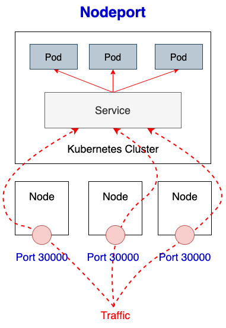

# Kubernetes basic usage learning

## Motivation

I saw many people who want to learn with Kubernetes but they don't have much time for reading a bunch of definitions to understand how it works.

Or just because many tutorials focus on the definitions of Kubernetes and they don't have practical examples on deploying a application from End to End

Therefore, I made this small project with the aiming to support those, who want to learn k8s but don't have much time, to have the basic mindset of how Kubernetes works and how to work with it.

In this guideline, we will cover basic knowledge of K8s with step by step examples and I hope this can help other beginners

> If you want to learn fully about Kubernetes please read [Kubernetes documentation](https://kubernetes.io/docs/tutorials/)

**! Importants**:

- We won't go depth into Docker in this guideline, but some basic knowledge in Docker and dockerize will be required. You can go to [Docker get started](https://docs.docker.com/get-started/) for a quick review about docker before we can move on

- When you go through this guideline, the explanations may not correct 100% with the definitions on the official Documentation, since the target of this project is helping people have the general/basic knowledge on K8s.
  Therefore, I made this as simple as I can to help understand eaiser, and some of them are just the conclusion from my experience.

Please let me know if any part of this guideline have incorrect, all of contributions are appreciated to make this guideline better

<!-- vim-markdown-toc GFM -->

* [Docker - Basic knowledge before we start](#docker---basic-knowledge-before-we-start)
  * [What is Docker](#what-is-docker)
  * [Docker Requirement](#docker-requirement)
  * [Learning Resource](#learning-resource)
* [Kubernetes](#kubernetes)
  * [What is Kubernetes:](#what-is-kubernetes)
  * [Kubernetes concepts and components](#kubernetes-concepts-and-components)
* [Physical level](#physical-level)
  * [Preparation](#preparation)
  * [How to connect to Kubernetes cluster](#how-to-connect-to-kubernetes-cluster)
  * [Simple command to work with Kubernetes Cluster](#simple-command-to-work-with-kubernetes-cluster)
* [Logical level](#logical-level)
  * [Preparation](#preparation-1)
  * [Deploy basic application (Deployment, replicaSet, and pod)](#deploy-basic-application-deployment-replicaset-and-pod)
    * [Deployment](#deployment)
      * [Working with Deployment](#working-with-deployment)
      * [Scenarios 1: Scale up the deployment to facilitate more load](#scenarios-1-scale-up-the-deployment-to-facilitate-more-load)
      * [Scenarios 2:  Redeploy the application with Deployment](#scenarios-2--redeploy-the-application-with-deployment)
      * [Scenarios 3: Rollback to Previous Deployment](#scenarios-3-rollback-to-previous-deployment)
      * [Scenarios 4: Test Application with Port-forward](#scenarios-4-test-application-with-port-forward)
    * [ReplicaSet](#replicaset)
      * [Working with ReplicaSet](#working-with-replicaset)
    * [Pod](#pod)
      * [Working with Pods](#working-with-pods)
      * [Scenarios 1: Testing loadbalancing request to Pod](#scenarios-1-testing-loadbalancing-request-to-pod)
      * [Scenarios 2: Transfer files between local and Container in Pod](#scenarios-2-transfer-files-between-local-and-container-in-pod)
      * [Scenarios 3: Execute command to container in Pod](#scenarios-3-execute-command-to-container-in-pod)
      * [Scenarios 4: Delete (recreate) a Pod](#scenarios-4-delete-recreate-a-pod)
  * [Expose application (Service)](#expose-application-service)
    * [ClusterIp](#clusterip)
    * [Nodeport](#nodeport)
    * [Loadbalancer (Cloud)](#loadbalancer-cloud)
    * [Scenarios: Test communicate between Pod in Cluster](#scenarios-test-communicate-between-pod-in-cluster)
  * [Set environment for Aplication on Kubernetes](#set-environment-for-aplication-on-kubernetes)
    * [Option 1: Set environment directly to deployment](#option-1-set-environment-directly-to-deployment)
    * [Option 2: Using Configmap](#option-2-using-configmap)
  * [Cronjob and jobs](#cronjob-and-jobs)
    * [Jobs](#jobs)
    * [Cronjob](#cronjob)
  * [Control project's components in logical level (namespace)](#control-projects-components-in-logical-level-namespace)
    * [Working with namespace](#working-with-namespace)
    * [Scenarios 1: Deploy with different namespace](#scenarios-1-deploy-with-different-namespace)

<!-- vim-markdown-toc -->

## Docker - Basic knowledge before we start

If you want to learn to use Kubernetes, you must know how to work with Docker first. It's because Kubernetes will host your service/application as a Docker container from Docker image.

By that, we will need to understand how to Dockerize an application and understand to work/troubleshoot a Docker container first 

**Going back in time:**

Years ago, most software applications were big and a application can include many services or jobs, including serving external connections as Hub, processing logical requests as a backend, or even serving frontend pages.

Those software applications development used to call with name `monolithic` application.

These monolithic applications are used to run a single process with all components on a handful server, this development system can work but it's hard to scale up and have many potential harmful to the server itself or the company business.

For instance:
- With many components running inside one server, this is challenging for scaling up when the server cannot handle more works.
- Or when we have an issue with the running server, it will take time to troubleshoot and identify which components cause the issue, the root cause is from the software or the hardware. And how can we make the service online ASAP.
- And there still have many issues with the security or automating, I haven't mentioned.

with the developing of software development, these big monolithic legacy applications are slowly being broken down into smaller, independently running components called `microservices`. 

The microservices can understand as an architectural pattern that we have many independent applications, which play certain roles or serve a single service. 
These services communicate with each other via a well-defined interface using lightweight apis and because they are independently run, each service can be updated, deployed, and scaled to meet the demand for specific functions of an application.


The microservice replacing the old architectural (monolithic application) and resolve many problems in architecture and scaling, but with the developing of the product or expanding of business, 
the number of components requires to deploy increases time by time, and it becomes difficult to configure, manage and keep the whole system running smoothly.

And this also bring the complexity on deployment process, since we have to choose the deploying server carefully before deploy to avoid:
- Application requires libraries conflict other Applications on the same server
- Networking between server (or between Application) must secure and open, if network have any issue, it also affect to the application
- If we want to deploy the same application on the new environment, we have to reconfiguration the server again, and this will be a painful for reconfig a project was built for long time ago and some old Libraries isn't exist anymore.


With those difficult, docker come up with a high advantage in packaging source code and deploying it in an isolated environment which is not related much to the hosting machine.


### What is Docker

> " Docker is an open platform for developing, shipping, and running applications. Docker enables you to separate your applications from your infrastructure so you can deliver software quickly.
>
>   With Docker, you can manage your infrastructure in the same ways you manage your applications. By taking advantage of Docker’s methodologies for shipping, testing, and deploying code quickly, you can significantly reduce the delay between writing code and running it in production.

Basically, Docker is an open-source platform that we can package (or "Image" in docker) our application with its whole environment need, this can be a few libraries or any filesystem of an installed operating system. 

To run your application with this Docker Image, we just need to run it on the Docker environment, and it will create a Docker Container to host/run our application
Or we can transfer Docker Image(s) to a storage to store it for future usage or moving it between machines, it's Docker Registry

With this mechanism, we can deploy to multiple servers at the same time without doing any re-configuration on hosting servers.
Or we can only restart the docker container to make it back to the original state when happening any urgent issue and impact directly to business

There are three main Docker components:

**Images** :
- Basically, a Docker image has everything needed to run a containerized application, including code, config files, environment variables, libraries, and runtimes. 
- To make a Docker image, we must have a Dockerfile that including a base image and a set of commands to copy application source code to the base image or install needed libraries

**Containers** :
- We can understand the docker container is virtualized runtime environment of an application from Docker image, which means we start running our application under the docker environment.
- We can have multiple containers running on one hosting server and it's completely isolated from both host and all other containers. 
  However, Container can be set with a network to connect between containers to containers or expose ports to open the connection between the host

**Registry** :
- A Docker Registry is a place that stores your Docker images and facilitates easy sharing of those images between different users and computers.
  When you build your image, you can either run it on the computer you’ve built it on, or you can push (upload) the image to a registry and then pull (download) it on another computer and run it there.
- Certain registries are public (Docker hub), allowing anyone to pull images from it, while others are private, only accessible to certain people or machines.


### Docker Requirement

To follow this guideline, you must have:
- Docker installed in your machine, check [Docker install](https://docs.docker.com/engine/install/) if you don't have it


### Learning Resource

I have created a python application to demonstrate this guideline and I call it [dummy-api](./dummy-api).

If you want to run it directly in your local to know how it's working, please check [dummy-api Readme](./dummy-api/README.md)

In the project, I have created a [Dockerfile](./dummy-api/Dockerfile) which contains steps to build a docker image

Then we in the next step I will show how can we dockerize this application to prepare to deploy it to Kubernetes env.
Make sure your Docker server is up and running. Now we will create a Docker image in our local machine.

1. Open terminal and go to folder [dummy-api](./dummy-api)

1. Execute command below:
    ```bash
      docker build -t dummy-api:1 .
    ```

1. When it's finished, we can check created docker image with:
    ```bash
      docker images
    ```

    You will get response like this
    ``` 
      REPOSITORY             TAG             IMAGE ID       CREATED         SIZE
      dummy-api              1               f1060ccb9b7e   6 seconds ago   58.9MB
    ```

**Test running this docker image (Optional)**

Execute command below, it will run your built image as a docker container and we will able to access it

```bash
  docker run -d --name dummy-container -p 105:105 dummy-api:1

  # Args explain
  #  -d      : The container will run in background
  #  --name  : Set the name of creating container, will random if we dont set
  #  -p      : Forward internal port of container (left) to external port of our machine (right). Cannot access to container if we dont set

```

Then you can test it by open your browser and navigate to http://localhost:105

- To view all of your docker container
    ```bash 
      docker ps -a
    ```

- To get the realtime log of the container
    ```bash
      docker logs -f dummy-container
    ```

- To run shell inside a container
    ```bash
      docker exec -it dummy-container sh   # Some container have bash shell so we can use it instead of "sh"
    ```

-  To stop the container and all of it changes content still there
    ```bash
      docker stop dummy-container
    ```

- We can start the stopped container again
    ```bash
      docker start dummy-container
    ```

- And remove it, all its contents are removed and it can’t be started again.
    ```bash
      docker rm dummy-container
    ```

> **Note**: The container loaded from your docker image, so if we stop or remove the container it will not affect to the built image.

- To push docker image to Docker Hub or your personal registries
    ```bash
      docker push dummy-api:1
    ```

- In case, you want to remove the docker image on your local machine after testing
```bash
  docker rmi dummy-api:1
```

## Kubernetes

In the above session, we have a general idea about Docker and the usage of Docker or containerization in helping deploy microservice architecture.
And that was great since Docker solve most of the issues of software development, and Docker seems to have all the parts we need to build, deploy an application. 
But why do we still need Kubernetes?

**Going back in time**:

With the evolution of software development:


- **Traditional deployment**:

    Applications ran directly on the physical servers and as mentioned in the above session, we will have many potential issues with the server, 
    from libraries conflict between applications to one application can damage all other applications due to crashes or hack. 

    Besides, the resource consumption between application isn't defined clearly, which lead to one application can use most of the server resource and all other application would crash or underperforming. 

    And to avoid those issues, each application must run on a different server, but this solution isn't utilized hardware resources and it causes organizations more money to maintain those servers.


- **Virtualized deployment**:
    
    For archiving the goals of isolated application on each server but still reducing the maintenace cost, we applied virtualization.
    
    With virtualization, we can split a physical server into small isolated Virtual Machines (VMs). With this approach, we can actively control the resource usage of each application and security
    
    However, since each VM is a full machine running all the components, including OS system, libraries, etc., this makes jobs for provisioning, managing and backing up much more difficult and required more skills to do it

    Besides, managing a bunch of VMs and maintenance network between VMs also a challenging for Ops


- **Containers deployment**:
  
    Follow with the VMs, Containers deployment is a new evolution with the concept to separate software deployment with hardware.

    Applications will be isolated in an individual areas with necessary components/libraries but not including the Operating System (OS), which will share between containers in the same server.

    However, the usage of containerization still related much to manual works but with the growth of the product or expanding of the business domain, Dev team always have to deal with other stuff:
    - Manage deployed containers in server to ensure no downtime, this will include monitoring and failure-handling system
    - We cannot deploy manually everything, those works must be automated and acknowledged when the deployment isn't success
    - Managing resources/servers to keep server always has capable to load new deployment and recycle logs to avoid disk run out.

That's how Kubernetes comes to the rescue! Kubernetes provides you with a framework to run distributed systems resiliently.

It takes care of scaling and failover for your application, provides deployment patterns, and more. For example, Kubernetes can easily manage a canary deployment for your system.

### What is Kubernetes:

> " Kubernetes is a portable, extensible, open-source platform for managing containerized workloads and services, that facilitates both declarative configuration and automation. It has a large, rapidly growing ecosystem. Kubernetes services, support, and tools are widely available.

In a simple understanding, Kubernetes (also known as k8s) is an open-source container orchestration platform that automates many of the manual processes involved in deploying, managing, and scaling containerized applications.

Kubernetes can speed up, automates the development process by making it easy with configuration template in Yaml format or command, with simple defined components and can load it directly to the cluster for deployment.
And it also provides self-healing for applications with features to detect and restart services when container crashes.

With the benefits of Kubernetes, any developer can package up applications and deploy them on Kubernetes with basic Docker knowledge.
And the role of Ops will shift from supervising individual applications to managing the entire Kubernetes cluster

### Kubernetes concepts and components

To make this guideline simple and help you with a general overview of Kubernetes, I will split the concept of Kubernetes into 2 levels, physical and logical levels.

- In physical level, we have definitions related to hardware components of Kubernetes, and how we can connect/manage Kubernetes

- In logical level, we will learn how to deploy an application to Kubernetes and also go through some basic components for deploying an application to Kubernetes.

## Physical level

Kubernetes is not about a single server hosting a management system, it's a group of many servers (at least 2 servers) connected into a cluster.

In Kubernetes cluster, all connected servers will be a "node" of the cluster and a node can be a virtual or physical server, depending on the cluster

Node(s) in Kubernetes is divided into 2 types, Master and worker.

- **Master Node**: Usually only one server and it will be the controller of the entire cluster.

    In another understand, this looks like a virtual Sys Admin, who will watch your system 24/7 and do all the action needed to keep the cluster running

- **Worker Node(s)**: Is the group of servers to host your running applications (containers)


> Note: In a learning or resource-limited environment, you might have only one node and it will have both roles as Master and Worker

### Preparation

To follow this guideline, you must have:
- Docker installed in your machine, check [Docker install](https://docs.docker.com/engine/install/) if you don't have it

- Docker Desktop with Kubernetes activated or Minikube
  - Docker Desktop: Read [Docker Deskop - Kubernetes](https://docs.docker.com/desktop/kubernetes/) for how to enable K8s
  - Minikube: If you don't have kubernetes in your Docker Desktop, then follow [Minikube](https://github.com/kubernetes/minikube) to install it.

- kubectl command which will use most of the time to work with Kubernetes, check [Kubernetes install tools](https://kubernetes.io/docs/tasks/tools/)

### How to connect to Kubernetes cluster

To connect to a Kubernetes cluster, we must have 2 things, a kubeconfig file and Kubectl (CLI)

- **kubectl**:

    Is a command line interface (CLI) to help us interact with Kubernetes from managing resources to setup and deploy your application. 

    We can install the Kubectl command in [Kubernetes install tools](https://kubernetes.io/docs/tasks/tools/)

- **Kubeconfig**:

    Can understand as the key to access to the Kubernetes cluster, this file contains information and credential of Kubernetes cluster.

    The syntax of Kubeconfig file should similar to this:

    ```yaml
    apiVersion: v1
    clusters:
    - cluster:
        certificate-authority-data: ... # Certificate of the cluster, this will different for each individual
        server: http://kubernetes.docker.internal:6443       # Cluster url
      name: docker-desktop
    contexts:
    - context:
        cluster: docker-desktop
        user: docker-desktop
      name: docker-desktop
    current-context: docker-desktop
    kind: Config
    preferences: {}
    users:
    - name: docker-desktop
      user:
        client-certificate: ...    # Client cert to authority with Kubernetes
        client-key: ...            # Client key to authority with Kubernetes
    ```

By default kubectl will expect kubeconfig, represented as a file named `config` to be present in the `$HOME/.kube` directory.

Then if we want to do anything with the cluster, just type down the command
```bash
  kubectl cluster-info
```

We also can specify other kubeconfig files by setting the KUBECONFIG environment variable 
```bash
  export KUBECONFIG=/path/to/my/kubeconfig
  kubectl cluster-info
```
Or by setting the --kubeconfig flag.
```bash
  kubectl cluster-info --kubeconfig /path/to/my/kubeconfig
```

### Simple command to work with Kubernetes Cluster

For the basic, we have serveral command to work with k8s cluster in "physical" way

- To get the cluster infomation
  ```bash
  $ kubectl cluster-info

  # Sample response
  Kubernetes control plane is running at https://kubernetes.docker.internal:6443
  KubeDNS is running at https://kubernetes.docker.internal:6443/api/v1/namespaces/kube-system/services/kube-dns:dns/proxy
  ```

- Check cluster status
  ```bash
  $ kubectl get cs

  # Sample Response
  NAME                 STATUS    MESSAGE             ERROR
  scheduler            Healthy   ok
  controller-manager   Healthy   ok
  etcd-0               Healthy   {"health":"true"}
  ```

- To get all worker nodes of the cluster
  ```bash
  $ kubectl get nodes --show-labels

  # Sample Response
  NAME             STATUS   ROLES    AGE    VERSION   LABELS
  docker-desktop   Ready    master   233d   v1.19.7   beta.kubernetes.io/arch=arm64,beta.kubernetes.io/os=linux,kubernetes.io/arch=arm64,kubernetes.io/hostname=docker-desktop,kubernetes.io/os=linux,node-role.kubernetes.io/master=
  ```

- We aslo can inspect the node information to see the resource usage and pods running on this node
  ```bash
  $ kubectl describe node/[NODE NAME]

  # Sample
  $ kubectl describe node/docker-desktop
  Name:               docker-desktop
  Roles:              master
  Labels:             beta.kubernetes.io/arch=arm64
                      beta.kubernetes.io/os=linux
                      kubernetes.io/arch=arm64
                      kubernetes.io/hostname=docker-desktop
                      kubernetes.io/os=linux
                      node-role.kubernetes.io/master=
  Annotations:        kubeadm.alpha.kubernetes.io/cri-socket: /var/run/dockershim.sock
                      node.alpha.kubernetes.io/ttl: 0
                      volumes.kubernetes.io/controller-managed-attach-detach: true
  CreationTimestamp:  Wed, 19 May 2021 09:22:29 +0700
  Taints:             <none>
  Unschedulable:      false
  Lease:
    HolderIdentity:  docker-desktop
    AcquireTime:     <unset>
    RenewTime:       Fri, 14 Jan 2022 14:53:15 +0700
  Conditions:
    Type             Status  LastHeartbeatTime                 LastTransitionTime                Reason                       Message
    ----             ------  -----------------                 ------------------                ------                       -------
    MemoryPressure   False   Fri, 14 Jan 2022 14:53:20 +0700   Thu, 03 Jun 2021 14:08:29 +0700   KubeletHasSufficientMemory   kubelet has sufficient memory available
    DiskPressure     False   Fri, 14 Jan 2022 14:53:20 +0700   Thu, 03 Jun 2021 14:08:29 +0700   KubeletHasNoDiskPressure     kubelet has no disk pressure
    PIDPressure      False   Fri, 14 Jan 2022 14:53:20 +0700   Thu, 03 Jun 2021 14:08:29 +0700   KubeletHasSufficientPID      kubelet has sufficient PID available
    Ready            True    Fri, 14 Jan 2022 14:53:20 +0700   Thu, 03 Jun 2021 14:08:29 +0700   KubeletReady                 kubelet is posting ready status
  Addresses:
    InternalIP:  192.168.65.4
    Hostname:    docker-desktop
  Capacity:
    cpu:                6
    ephemeral-storage:  206160872Ki
    hugepages-1Gi:      0
    hugepages-2Mi:      0
    hugepages-32Mi:     0
    hugepages-64Ki:     0
    memory:             12250136Ki
    pods:               110
  Allocatable:
    cpu:                6
    ephemeral-storage:  189997859321
    hugepages-1Gi:      0
    hugepages-2Mi:      0
    hugepages-32Mi:     0
    hugepages-64Ki:     0
    memory:             12147736Ki
    pods:               110
  System Info:
    Machine ID:                 aa22a80b-e31d-4df8-9fdc-394a59734df5
    System UUID:                aa22a80b-e31d-4df8-9fdc-394a59734df5
    Boot ID:                    a68e41e4-21b4-44ff-9467-8fba571a2dae
    Kernel Version:             5.10.76-linuxkit
    OS Image:                   Docker Desktop
    Operating System:           linux
    Architecture:               arm64
    Container Runtime Version:  docker://20.10.11
    Kubelet Version:            v1.19.7
    Kube-Proxy Version:         v1.19.7
  Non-terminated Pods:          (12 in total)
    Namespace                   Name                                         CPU Requests  CPU Limits  Memory Requests  Memory Limits  Age
    ---------                   ----                                         ------------  ----------  ---------------  -------------  ---
    ingress-nginx               ingress-nginx-controller-69db7f75b4-r9rdj    100m (1%)     0 (0%)      90Mi (0%)        0 (0%)         17d
    kube-system                 coredns-5d696d9866-5qnj5                     100m (1%)     0 (0%)      70Mi (0%)        170Mi (1%)     3d14h
    kube-system                 coredns-5d696d9866-vwflh                     100m (1%)     0 (0%)      70Mi (0%)        170Mi (1%)     3d14h
    kube-system                 etcd-docker-desktop                          0 (0%)        0 (0%)      0 (0%)           0 (0%)         240d
    kube-system                 kube-apiserver-docker-desktop                250m (4%)     0 (0%)      0 (0%)           0 (0%)         240d
    kube-system                 kube-controller-manager-docker-desktop       200m (3%)     0 (0%)      0 (0%)           0 (0%)         240d
    kube-system                 kube-proxy-xntwj                             0 (0%)        0 (0%)      0 (0%)           0 (0%)         240d
    kube-system                 kube-scheduler-docker-desktop                100m (1%)     0 (0%)      0 (0%)           0 (0%)         240d
    kube-system                 storage-provisioner                          0 (0%)        0 (0%)      0 (0%)           0 (0%)         240d
    kube-system                 vpnkit-controller                            0 (0%)        0 (0%)      0 (0%)           0 (0%)         240d
  Allocated resources:
    (Total limits may be over 100 percent, i.e., overcommitted.)
    Resource           Requests    Limits
    --------           --------    ------
    cpu                850m (14%)  0 (0%)
    memory             230Mi (1%)  340Mi (2%)
    ephemeral-storage  0 (0%)      0 (0%)
    hugepages-1Gi      0 (0%)      0 (0%)
    hugepages-2Mi      0 (0%)      0 (0%)
    hugepages-32Mi     0 (0%)      0 (0%)
    hugepages-64Ki     0 (0%)      0 (0%)
  Events:              <none>
  ```

## Logical level

In a logical way, Kubernetes come up with lots of new definitions and components.
For each component, it will have a specific role to support deploying, managing containers (applications).

Therefore to help understand easier, through this guideline we will deploy a simple application to Kubernetes
and I will explain each related component in each step.

> **! Important**:
>
>   To do most of the deploying process, we will use the Yaml template, which is provided by Kubernetes, and only use the command to execute apply the template.
>
>   Although we can do deployment with command-line, it's quite complicated to set advantage parameters during the deployment process and it's hard to scale up with automation.
>
>   And we will use command-lines to interact with the Kubernetes components

### Preparation

To follow this guideline, you must have:
- Docker installed in your machine, check [Docker install](https://docs.docker.com/engine/install/) if you don't have it

- Docker Desktop with Kubernetes activated or Minikube
  - Docker Desktop: Read [Docker Deskop - Kubernetes](https://docs.docker.com/desktop/kubernetes/) for how to enable K8s
  - Minikube: If you don't have kubernetes in your Docker Desktop, then follow [Minikube](https://github.com/kubernetes/minikube) to install it.

  > **Note**: For this guideline I will use Docker Desktop as the test environment for Kubernetes

- kubectl command which will use most of the time to work with Kubernetes, check [Kubernetes install tools](https://kubernetes.io/docs/tasks/tools/)

>**! Important**:
>
>   Make sure you have followed [Docker#learning-resource](#learning-resource) and dockerize the dummy-api application first

### Deploy basic application (Deployment, replicaSet, and pod)

At this point, I will assume we already have Docker desktop running on our local machine as the test environment and it has Kubernetes enabled.

And also created a docker image for the `Dummy-api` application.

Then we will begin deploying this application to Kubernetes environment.

But first, we will have a deployment template to guide Kubernetes on how to deploy our application.

> I have prepared the deployment template for us to use on this sample, [./kubernetes/deployments/deployment.yaml](./kubernetes/deployments/deployment.yaml)
```yaml
apiVersion: apps/v1                      # Api version of Kubernetes
kind: Deployment                         # Resource usage  
metadata:                                # Deployment information
  name: dummy-api
  labels:
    app: demo
spec:                                    # Deployment content
  replicas: 1                            # Number of containers will create
  selector:
    matchLabels:
      app: demo
  template:                              # Template information for the container
    metadata:
      labels:
        app: demo
    spec:
      containers:
      - name: demo-container             # Container name after deploy
        image: dummy-api:1               # Image usage
        imagePullPolicy: IfNotPresent    # By default it's "Always" but for local env I use this for saving time
        ports:                           # Port of container
        - containerPort: 105
```

Then execute command to deploy this to Kubernetes cluster
```bash
$ kubectl apply -f kubernetes/deployments/deployment.yaml

# Sample response
deployment.apps/dummy-api created
```

With the same sample response on your terminal, which means your application has been deployed to the Kubernetes cluster

To check the deployed deployment, you can run the command:
```bash
$ kubectl get deployment

# Sample response
NAME        READY   UP-TO-DATE   AVAILABLE   AGE
dummy-api   1/1     1            1           10s
```

That it, it's simple like that.

**But what exactly happening in Kubernetes**:

When you start loading your deployment template to deploy your application into Kubernetes.
It's not simple as putting your application to any server in Kubernetes, this is the combining of 3 main components of Kubernetes,
Deployment, replicaSet and Pod(s).


#### Deployment

At first, the "Deployment" resource will be created after triggering the deploy command.

The deployment is used to control the life cycle of the application on Kubernetes, which means this will tell Kubernetes how to create or modify the related resources that hold your containerized application. All of the features include:
- Control the number of replicate containers that will be run on Kubernetes
- Help roll out the new update of your application, including deployment strategies to minimize deployment downtime or significantly impact the user.

    > **! If you don't know**:
    >
    > Blue/Green Deployment is one of the popular deployment strategies in Kubernetes
    >
    > Blue/Green deployment consists of two environments; Blue and Green.
    > The Green environment receives public traffic which hosts your current application. On the flip side, the Blue environment is not available to the public and contains new application versions. 
    >
    > After a few health checks on the Blue environment without any crash on the containerized level, the Blue environment will become green for serving the new connection and the old environment will be destroyed to save resource

##### Working with Deployment

- **Get/List all deployments**:
```bash
$ kubectl get deployment

# Sample response
NAME        READY   UP-TO-DATE   AVAILABLE   AGE
dummy-api   1/1     1            1           10s
```

- **Get deployment status**:
```bash
$ kubectl rollout status deployment/[DEPLOYMENT NAME]

# Sample 
$ kubectl rollout status deployment/dummy-api
deployment "dummy-api" successfully rolled out
```

If you get the same response which means your deployment has been successfully deployed

- **Get Deployment information**:
```bash
$ kubectl describe deployment/[DEPLOYMENT NAME]

# Sample
$ kubectl describe deployment/dummy-api
Name:                   dummy-api
Namespace:              default
CreationTimestamp:      Mon, 10 Jan 2022 16:31:48 +0700
Labels:                 app=demo
                        version=1
Annotations:            deployment.kubernetes.io/revision: 1
Selector:               app=demo
Replicas:               1 desired | 1 updated | 1 total | 1 available | 0 unavailable
StrategyType:           RollingUpdate
MinReadySeconds:        0
RollingUpdateStrategy:  25% max unavailable, 25% max surge
Pod Template:
  Labels:  app=demo
  Containers:
   demo-container:
    Image:        dummy-api:1
    Port:         105/TCP
    Host Port:    0/TCP
    Environment:  <none>
    Mounts:       <none>
  Volumes:        <none>
Conditions:
  Type           Status  Reason
  ----           ------  ------
  Available      True    MinimumReplicasAvailable
  Progressing    True    NewReplicaSetAvailable
OldReplicaSets:  <none>
NewReplicaSet:   dummy-api-55b48f6c47 (1/1 replicas created)
Events:
  Type    Reason             Age    From                   Message
  ----    ------             ----   ----                   -------
  Normal  ScalingReplicaSet  3m10s  deployment-controller  Scaled up replica set dummy-api-55b48f6c47 to 1
```

> **! Tips**:
> 
> Sometimes you will your application isn't live but the message shows the deployment has been successfully deployed.
> You may need to check the "Events" in the deployment resource, it can provide some details on the issue

- **Delete the deployment**:

We can delete the deployment based on the template with command:
```bash
$ kubectl delete -f kubernetes/deployments/deployment.yaml
```

Or we can direct delete the deployment with it name
```bash
$ kubectl delete deployment/[DEPLOYMENT NAME]

# Sample
$ kubectl delete deployment/dummy-api
```

##### Scenarios 1: Scale up the deployment to facilitate more load

We can scale up the number of running container(s) on Kubernetes to help avoid overload in the container.
```bash
$ kubectl scale deployment/[DEPLOYMENT NAME] --replicas=[NUM]

# Sample response
$ kubectl scale deployment/dummy-api --replicas=2
deployment.apps/dummy-api scaled
```

then we can check the deployment again for the changes
```bash
$ kubectl get deployment

# Sample response
NAME        READY   UP-TO-DATE   AVAILABLE   AGE
dummy-api   2/2     2            2           30m
```

##### Scenarios 2:  Redeploy the application with Deployment

When we want to redeploy the application with the new version, we just need to use the old deployment template and replace it with the new docker image version.

  1. I will retag the docker image of Dummy-api to pretend this is the new version of Dummy-api
      ```bash
      $ docker tag dummy-api:1 dummy-api:2
      ```

  1. Then we will change the deployment template for the new version of application.

      For this sample, I have prepared another deployment template [kubernetes/deployments/deployment-v2.yaml](./kubernetes/deployments/deployment-v2.yaml)
      ```yaml
      apiVersion: apps/v1
      kind: Deployment
      metadata:
        name: dummy-api
        labels:
          app: demo
      spec:
        replicas: 1
        selector:
          matchLabels:
            app: demo
        template:
          metadata:
            labels:
              app: demo
          spec:
            containers:
            - name: demo-container
              image: dummy-api:2              # Updated new docker image version
              imagePullPolicy: IfNotPresent
              ports:
              - containerPort: 105
      ```

  1. Start deploying this template to Kubernetes cluster
      ```bash
      $ kubectl apply -f deployment-v2.yaml

      # Sample response
      deployment.apps/dummy-api configured
      ```

  1. We can get the deployment information for the new updates
      ```bash
      $ kubectl describe deployment/dummy-api

      # Sample response
      Name:                   dummy-api
      Namespace:              default
      CreationTimestamp:      Mon, 10 Jan 2022 16:31:48 +0700
      Labels:                 app=demo
      Annotations:            deployment.kubernetes.io/revision: 2
      Selector:               app=demo
      Replicas:               1 desired | 1 updated | 1 total | 1 available | 0 unavailable
      StrategyType:           RollingUpdate
      MinReadySeconds:        0
      RollingUpdateStrategy:  25% max unavailable, 25% max surge
      Pod Template:
        Labels:  app=demo
        Containers:
         demo-container:
          Image:        dummy-api:2
          Port:         105/TCP
          Host Port:    0/TCP
          Environment:  <none>
          Mounts:       <none>
        Volumes:        <none>
      Conditions:
        Type           Status  Reason
        ----           ------  ------
        Available      True    MinimumReplicasAvailable
        Progressing    True    NewReplicaSetAvailable
      OldReplicaSets:  <none>
      NewReplicaSet:   dummy-api-5b599c48c6 (1/1 replicas created)
      Events:
        Type    Reason             Age   From                   Message
        ----    ------             ----  ----                   -------
        Normal  ScalingReplicaSet  48m   deployment-controller  Scaled up replica set dummy-api-55b48f6c47 to 1
        Normal  ScalingReplicaSet  18m   deployment-controller  Scaled up replica set dummy-api-55b48f6c47 to 4
        Normal  ScalingReplicaSet  9s    deployment-controller  Scaled down replica set dummy-api-55b48f6c47 to 1
        Normal  ScalingReplicaSet  9s    deployment-controller  Scaled up replica set dummy-api-5b599c48c6 to 1
        Normal  ScalingReplicaSet  7s    deployment-controller  Scaled down replica set dummy-api-55b48f6c47 to 0
      ```

##### Scenarios 3: Rollback to Previous Deployment

- **Get Deployment history**:
```bash
$ kubectl rollout history deployment/[DEPLOYMENT NAME]

# Sample 
$ kubectl rollout history deployment/dummy-api
deployment.apps/dummy-api
REVISION  CHANGE-CAUSE
1         <none>
2         <none>
```

`CHANGE-CAUSE` is copied from the Deployment annotation "kubernetes.io/change-cause", and we can set it for each deployment.

And to view the detail of each revision:
```bash
$ kubectl rollout history deployment/[DEPLOYMENT NAME] --revision=[NUM]

# Sample
$ kubectl rollout history deployment/dummy-api --revision=2
deployment.apps/dummy-api with revision #2
Pod Template:
  Labels:	app=demo
	pod-template-hash=5b599c48c6
  Containers:
   demo-container:
    Image:	dummy-api:2
    Port:	105/TCP
    Host Port:	0/TCP
    Environment:	<none>
    Mounts:	<none>
  Volumes:	<none>
```

- **Rolling Back to a Previous Revision**:
```bash
$ kubectl rollout undo deployment/[DEPLOYMENT NAME] --to-revision=[NUM]

# Sample
$ kubectl rollout undo deployment/dummy-api --to-revision=1
deployment.apps/dummy-api rolled back
```

Then we can inspect the deployment to check it
```bash
$ kubectl describe deployment/dummy-api

# Sample response
Name:                   dummy-api
Namespace:              default
CreationTimestamp:      Mon, 10 Jan 2022 16:31:48 +0700
Labels:                 app=demo
Annotations:            deployment.kubernetes.io/revision: 4
Selector:               app=demo
Replicas:               2 desired | 2 updated | 2 total | 2 available | 0 unavailable
StrategyType:           RollingUpdate
MinReadySeconds:        0
RollingUpdateStrategy:  25% max unavailable, 25% max surge
Pod Template:
  Labels:  app=demo
  Containers:
   demo-container:
    Image:        dummy-api:1
    Port:         105/TCP
    Host Port:    0/TCP
    Environment:  <none>
    Mounts:       <none>
  Volumes:        <none>
Conditions:
  Type           Status  Reason
  ----           ------  ------
  Available      True    MinimumReplicasAvailable
  Progressing    True    NewReplicaSetAvailable
OldReplicaSets:  <none>
NewReplicaSet:   dummy-api-55b48f6c47 (2/2 replicas created)
Events:
  Type    Reason             Age                  From                   Message
  ----    ------             ----                 ----                   -------
  Normal  ScalingReplicaSet  7m53s                deployment-controller  Scaled up replica set dummy-api-5b599c48c6 to 2
  Normal  ScalingReplicaSet  7m6s                 deployment-controller  Scaled up replica set dummy-api-565c696947 to 1
  Normal  ScalingReplicaSet  7m5s                 deployment-controller  Scaled down replica set dummy-api-5b599c48c6 to 1
  Normal  ScalingReplicaSet  7m5s                 deployment-controller  Scaled up replica set dummy-api-565c696947 to 2
  Normal  ScalingReplicaSet  7m4s                 deployment-controller  Scaled down replica set dummy-api-5b599c48c6 to 0
  Normal  ScalingReplicaSet  43s (x2 over 3h42m)  deployment-controller  Scaled up replica set dummy-api-55b48f6c47 to 1
  Normal  ScalingReplicaSet  42s                  deployment-controller  Scaled down replica set dummy-api-565c696947 to 1
  Normal  ScalingReplicaSet  42s                  deployment-controller  Scaled up replica set dummy-api-55b48f6c47 to 2
  Normal  ScalingReplicaSet  41s                  deployment-controller  Scaled down replica set dummy-api-565c696947 to 0
```

As we saw, the `Image` has swapped to `dummy-api:1` which is dedicated to the first deployment


##### Scenarios 4: Test Application with Port-forward

Right now, the deployed application cannot be connected from anywhere.
If you have tried access to url `http://localhost:105` it won't work.

To make the appllication can serve the connection, we will mention it in [Expose application (Service)](#expose-application-service)

However, if we want to test it in debug mode, we can execute the command below
```bash
$ kubectl port-forward deployment/dummy-api 1055:105

# Sample response
Forwarding from 127.0.0.1:1055 -> 105
Forwarding from [::1]:1055 -> 105
```

Then we can access our application via url `http://localhost:1055`

```bash
$ curl http://localhost:1055/ping
pong!%
```

#### ReplicaSet

The "Deployment" resource aims to focus on controlling the life cycle of the application and when a new deployment is executed, ReplicaSet will be created after the deployment

The ReplicaSet's purpose is to maintain the number of Pods of each deployment or after scaling the deployment (in the above session).
Therefore, we can have multiple ReplicaSet presents for multiple deployed versions but all of them will be controlled by 1 Deployment resource.

> **! Important**:
>
>    Although ReplicaSet ensures that a specified number of pod replicas are running at any given time, Deployment is a higher-level concept that manages ReplicaSets and provides declarative updates to Pods along with a lot of other useful features.
>
>    Therefore, we recommend using Deployments instead of directly using ReplicaSets, unless you require custom update orchestration or don't require updates at all.

##### Working with ReplicaSet

- **Get replicaSet**:
```bash
$ kubectl get rs

# Sample response
NAME                   DESIRED   CURRENT   READY   AGE
dummy-api-55b48f6c47   0         0         0       3h17m    # This is the deploy of dummy-api version 1
dummy-api-5b599c48c6   1         1         1       149m     # The new update for dummy-api version 2 (last exsample)
```

- **Get replicaSet information**:
```bash
$ kubectl describe rs/[REPLICASET NAME]

# Sample
$ kubectl describe rs/dummy-api-5b599c48c6
Name:           dummy-api-5b599c48c6
Namespace:      default
Selector:       app=demo,pod-template-hash=5b599c48c6
Labels:         app=demo
                pod-template-hash=5b599c48c6
Annotations:    deployment.kubernetes.io/desired-replicas: 1
                deployment.kubernetes.io/max-replicas: 2
                deployment.kubernetes.io/revision: 2
Controlled By:  Deployment/dummy-api
Replicas:       1 current / 1 desired
Pods Status:    1 Running / 0 Waiting / 0 Succeeded / 0 Failed
Pod Template:
  Labels:  app=demo
           pod-template-hash=5b599c48c6
  Containers:
   demo-container:
    Image:        dummy-api:2
    Port:         105/TCP
    Host Port:    0/TCP
    Environment:  <none>
    Mounts:       <none>
  Volumes:        <none>
Events:           <none>
```

> **! Note**:
>
>    Since ReplicaSet will be created automatically in Deployment, the ReplicaSet will have the randomized name with the prefix is the name of Deployment

#### Pod

A Pod is the smallest unit of deployment in Kubernetes, it will focus on managing container(s).
Generally, we can have multiple containers in a single Pod, but in the recommendation, a Pod should have one container.

When a pod is created, by default it can be in any nodes of the cluster, but we can inject configuration in the Deployment template to deploy the Pod in the particular node.
This provides flexibility for the Cluster since k8s can balance the number of pods between workers to utilize the resource, and it also has benefits for containers in Pod.
If a node has issue(s) and cannot operate containers, kubernetes can move all containers to another node

##### Working with Pods

We can treat a pod as a Docker container and it can do most of the work we can do with the docker container

- **Get/List all Pods**:
```bash
$ kubectl get pods

# Sample response
NAME                         READY   STATUS    RESTARTS   AGE
dummy-api-55b48f6c47-dr24c   1/1     Running   0          51m
dummy-api-55b48f6c47-nfx8n   1/1     Running   0          51m
```

From the last example in Deployment, we have scaled the deployment to 2. Therefore we have 2 pods here, and because it's created automatically with Deployment template
the name of Pod will be randomized with prefix is the Deployment name

- **Inspect Pod Information**:
```bash
$ kubectl describe pod/[POD NAME]

# Sample
$ kubectl describe pod/dummy-api-55b48f6c47-nfx8n
Name:         dummy-api-55b48f6c47-nfx8n
Namespace:    default
Priority:     0
Node:         docker-desktop/192.168.65.4
Start Time:   Mon, 10 Jan 2022 20:13:31 +0700
Labels:       app=demo
              pod-template-hash=55b48f6c47
Annotations:  <none>
Status:       Running
IP:           10.1.3.181
IPs:
  IP:           10.1.3.181
Controlled By:  ReplicaSet/dummy-api-55b48f6c47
Containers:
  demo-container:
    Container ID:   docker://234b5139b416b707f4b8c94d9d01a7185ef836f963c40c171cfe1e36ba993a66
    Image:          dummy-api:1
    Image ID:       docker://sha256:b749b81b8b69783ee483865099cce56996e1ae009dbf0c6d8051f73c9e1e43b4
    Port:           105/TCP
    Host Port:      0/TCP
    State:          Running
      Started:      Mon, 10 Jan 2022 20:13:32 +0700
    Ready:          True
    Restart Count:  0
    Environment:    <none>
    Mounts:
      /var/run/secrets/kubernetes.io/serviceaccount from default-token-47xb9 (ro)
Conditions:
  Type              Status
  Initialized       True
  Ready             True
  ContainersReady   True
  PodScheduled      True
Volumes:
  default-token-47xb9:
    Type:        Secret (a volume populated by a Secret)
    SecretName:  default-token-47xb9
    Optional:    false
QoS Class:       BestEffort
Node-Selectors:  <none>
Tolerations:     node.kubernetes.io/not-ready:NoExecute op=Exists for 300s
                 node.kubernetes.io/unreachable:NoExecute op=Exists for 300s
Events:
  Type    Reason     Age   From               Message
  ----    ------     ----  ----               -------
  Normal  Scheduled  54m   default-scheduler  Successfully assigned default/dummy-api-55b48f6c47-nfx8n to docker-desktop
  Normal  Pulled     54m   kubelet            Container image "dummy-api:1" already present on machine
  Normal  Created    54m   kubelet            Created container demo-container
  Normal  Started    54m   kubelet            Started container demo-container
```

- **Get Log of container in Pod**:
```bash
$ kubectl logs [POD NAME]

# Sample
$ kubectl logs dummy-api-55b48f6c47-nfx8n
 * Serving Flask app 'app' (lazy loading)
 * Environment: development
 * Debug mode: on
 * Running on all addresses.
   WARNING: This is a development server. Do not use it in a production deployment.
 * Running on http://10.1.3.181:105/ (Press CTRL+C to quit)
 * Restarting with stat
 * Debugger is active!
 * Debugger PIN: 130-396-372
127.0.0.1 - - [10/Jan/2022 13:55:08] "GET / HTTP/1.1" 200 -
127.0.0.1 - - [10/Jan/2022 13:55:08] "GET /favicon.ico HTTP/1.1" 404 -
127.0.0.1 - - [10/Jan/2022 13:55:29] "GET /ping HTTP/1.1" 200 -
```

If we want to stream the logs realtime, you can add the flag `-f` in the command

##### Scenarios 1: Testing loadbalancing request to Pod

And when the end user request to our application, Kubernetes will loadbalancing the up comming request between pods to make sure there is no one way request to any particular pod.

- **Example**:

To prove the felexibily of the pod, we can scale up the above sample to 2 with command:
```bash
$ kubectl scale deployment/dummy-api --replicas=2
```

Then we will open the browser and access to our application via url http://localhost:30000, you can try reload the page a few time
and pay attention to the `Host name`.

You may see it's changed based on the pod name.

##### Scenarios 2: Transfer files between local and Container in Pod

- To copy file to container in pod
```bash
$ kubectl cp [FILE TO COPY] [POD NAME]:[DESTINATION]

# Sample
$ kubectl cp test.txt dummy-api-55b48f6c47-nfx8n:/tmp/
```

- To download file from container in pod
```bash
$ kubectl cp [POD NAME]:[FILE TO COPY] [DESTINATION]

# Sample
$ kubectl cp dummy-api-55b48f6c47-nfx8n:/tmp/test.txt .
```

##### Scenarios 3: Execute command to container in Pod

- To execute a simple command to container in pod
```bash
$ kubectl exec [POD NAME] -- [COMMAND]

# Sample
$ kubectl exec dummy-api-55b48f6c47-dr24c -- date
Mon Jan 10 14:23:50 UTC 2022
```

- To connect to container in pod
```bash
$ kubectl exec -it [POD NAME] -- sh -il

# Sample Command
$ kubectl exec -it dummy-api-55b48f6c47-dr24c -- sh -il
```

##### Scenarios 4: Delete (recreate) a Pod

We can delete the pod, but because we have the `ReplicaSet` to control the number of Pods for each Deployment.
So when we delete the pod, it will delete the target pod but also create a new pod to maintain the number of pods defined in ReplicaSet

```bash
# kubectl delete pods/[POD NAME]

# Sample response
$ kubectl delete pods/dummy-api-55b48f6c47-dr24c
pod "dummy-api-55b48f6c47-dr24c" deleted
```

When we check the list pods again
```bash
$ kubectl get pods

# Sample response
NAME                         READY   STATUS    RESTARTS   AGE
dummy-api-55b48f6c47-nfx8n   1/1     Running   0          80m
dummy-api-55b48f6c47-z6htv   1/1     Running   0          2s
```

### Expose application (Service)

As mentioned in the Deployment session, the running Pod cannot access out side the cluster.
The only way we can access it is under `kube-proxy` with `port-forward` but this way is only for development. 

If we want to make it for production and serving the public connection, we will need to expose it through `Service` resource of Kubernetes.

Right now, we have 3 types of Service in Kubernetes cluster

#### ClusterIp

ClusterIP is the default type of service, which is used to expose a service for internal access only.
This means the other applications can access (request) to this application's service but we can't access to this application externally


> Note: If you have delete the deployment, please check the [#deployment](#deployment) to deploy the dummy-api application again

To deploy the ClusterIP service we will use the template [service-clusterip.yaml](./kubernetes/services/service-clusterip.yaml)
```yaml
apiVersion: v1
kind: Service
metadata:
  name: dummy                 # Name of the service
  labels:
    app: demo
spec:                         # Service expose information
  selector:
    app: demo
  ports:
    - protocol: TCP
      port: 105
      targetPort: 105
```

Then we will deploy this service to kubernetes cluster
```bash
$ kubectl apply -f kubernetes/services/service-clusterip.yaml

# Sample response
service/dummy created
```

We can list the service
```bash
$ kubectl get service

# Sample response
NAME         TYPE        CLUSTER-IP     EXTERNAL-IP   PORT(S)   AGE
dummy        ClusterIP   10.97.23.218   <none>        105/TCP   9s
```

#### Nodeport

NodePorts are open ports on every cluster node. Kubernetes will route traffic that comes into a NodePort to the service, even if the service is not running on that node.

Therefore, each port can only dedicated to a service only, and the node port range of entire Kubernetes cluster is between `30000-32767`



> Note: If you have delete the deployment, please check the [#deployment](#deployment) to deploy the dummy-api application again

To deploy the NodePort service we will use the template [service-nodeport.yaml](./kubernetes/services/service-nodeport.yaml)
```yaml
apiVersion: v1
kind: Service
metadata:
  name: dummy                 # Name of the service
  labels:
    app: demo
spec:                         # Service expose information
  type: NodePort              # Specify the service type
  selector:
    app: demo
  ports:
    - protocol: TCP
      port: 105
      targetPort: 105
      nodePort: 30000         # Specify the node port
```

We can choose the port for this service type with `nodePort` in the above template, but it will be randomized in every deployment if we don't set

Then we will deploy this service to kubernetes cluster
```bash
$ kubectl apply -f kubernetes/services/service-nodeport.yaml

# Sample response
service/dummy created
```

We can list the service
```bash
$ kubectl get service

# Sample response
NAME         TYPE        CLUSTER-IP     EXTERNAL-IP   PORT(S)   AGE
dummy        NodePort    10.101.187.44   <none>        105:30000/TCP   11s
```

- **Test connect to Dummy-api through NodePort service (Optional)**

On your local machine, execute command below:
```bash
$ curl http://localhost:30000/ping

# Sample response
pong!%
```

or we can access to url `http://localhost:30000` to view the UI

#### Loadbalancer (Cloud)

This service type only works when we host the Kubernetes on Cloud providers which support external load balancers.

With the loadbalancer service type, the Kubernetes will request your Cloud provider and generate a new loadbalancer Url with we can set it to our DNS for public access.


> Note: If you have delete the deployment, please check the [#deployment](#deployment) to deploy the dummy-api application again

To Deploy the Loadbalancer service, we will use the template [service-loadbalancer.yaml](./kubernetes/services/service-loadbalance.yaml)
```yaml
apiVersion: v1
kind: Service
metadata:
  name: dummy
  labels:
    app: demo
spec:
  type: Loadbalancer
  selector:
    app: demo
  ports:
    - protocol: TCP
      port: 105
      targetPort: 105
```

Just need to deploy this service to Kubernetes cluster
```bash
$ kubectl apply -f kubernetes/services/service-loadbalance.yaml

# Sample response
service/dummy created
```

When we get the service we can have reponse like that
```bash
$ kubectl get service

# Sample response
NAME            TYPE           CLUSTER-IP       EXTERNAL-IP                                                             PORT(S)                             AGE
dummy           LoadBalancer   10.20.240.237    a57b64b7xxxxxxxxxxxxxxxxxxxxxxxx-xxxxxxxx.us-west-2.elb.amazonaws.com   105:31469/TCP                       35s
```

Then we just need to set the loadbalancer url `a57b64b7xxxxxxxxxxxxxxxxxxxxxxxx-xxxxxxxx.us-west-2.elb.amazonaws.com` to DNS for user to access

#### Scenarios: Test communicate between Pod in Cluster

First let assumed we already have at least one of three services type deployed for the Dummy api

  1. We will run another pod to test
  ```bash
  $ kubectl run --rm curl --image=radial/busyboxplus:curl -i --tty

  # Sample response
  If you don't see a command prompt, try pressing enter.
  [ root@curl:/ ]$
  ```

At this point, we already create another pod to the CLuster and we will try to call the Dummy-Api application through this Pod

  1. We just simple call the service name of the Dummy-Api application to connect to it, in this case is `dummy`:
  ```bash
  $ curl http://dummy:105/ping

  # Sample response
  pong!%
  ```

This means your Dummy-api application is now visible with other Pods in the Kubernetes cluster.

We also can try remove the service of Dummy api and run the command above again to see what happened when we don't have the Service resource

### Set environment for Aplication on Kubernetes

There is two ways we can set the environment variable to the container in development

#### Option 1: Set environment directly to deployment

In the deployment template, we can specify the component:
```yaml
...
  env:
    - name: VARIABLE_NAME
      value: "Value of variable"
```

For this example, we have a deployment template [kubernetes/environment/deployment-env.yaml](./kubernetes/environment/deployment-env.yaml)
```yaml
apiVersion: apps/v1
kind: Deployment
metadata:
  name: dummy-api
  labels:
    app: demo
spec:
  replicas: 1
  selector:
    matchLabels:
      app: demo
  template:
    metadata:
      labels:
        app: demo
    spec:
      containers:
        - name: demo-container
          image: dummy-api:1
          imagePullPolicy: IfNotPresent
          ports:
            - containerPort: 105
          env:                               # Update the environment for this deployment
            - name: GREETING_QUOTE
              value: "Deployment with direct environment variable"
```

Then we will execute deployment command
```bash
$ kubectl apply -f kubernetes/environment/deployment-env.yaml

# Sample response
deployment.apps/dummy-api configured
```

We can inspect the new deployment information
```bash
$ kubectl describe deployment/dummy-api

# Sample response
Name:                   dummy-api
Namespace:              default
CreationTimestamp:      Mon, 10 Jan 2022 16:31:48 +0700
Labels:                 app=demo
Annotations:            deployment.kubernetes.io/revision: 5
Selector:               app=demo
Replicas:               1 desired | 1 updated | 1 total | 1 available | 0 unavailable
StrategyType:           RollingUpdate
MinReadySeconds:        0
RollingUpdateStrategy:  25% max unavailable, 25% max surge
Pod Template:
  Labels:  app=demo
  Containers:
   demo-container:
    Image:      dummy-api:1
    Port:       105/TCP
    Host Port:  0/TCP
    Environment:
      GREETING_QUOTE:  Deployment with direct environment variable
    Mounts:            <none>
  Volumes:             <none>
Conditions:
  Type           Status  Reason
  ----           ------  ------
  Available      True    MinimumReplicasAvailable
  Progressing    True    NewReplicaSetAvailable
OldReplicaSets:  <none>
NewReplicaSet:   dummy-api-6c674cd646 (1/1 replicas created)
Events:
  Type    Reason             Age   From                   Message
  ----    ------             ----  ----                   -------
  Normal  ScalingReplicaSet  32s   deployment-controller  Scaled down replica set dummy-api-55b48f6c47 to 1
  Normal  ScalingReplicaSet  32s   deployment-controller  Scaled up replica set dummy-api-6c674cd646 to 1
  Normal  ScalingReplicaSet  31s   deployment-controller  Scaled down replica set dummy-api-55b48f6c47 to 0
```

As we can see the `Containers` has updated with the `Environment`.

- If we connect to the container and execute command `env`, we can see our environment
```bash
$ kubectl exec -it dummy-api-6c674cd646-hdqpvv -- sh -il

$ dummy-api-6c674cd646-hdqpv:/app# env | grep GREET
GREETING_QUOTE=Deployment with direct environment variable
```

- We can also connect to the application via Url http://localhost:30000 and saw the changes of the quote
  
  We may need to deploy the Service to expose the Dummy-api 
  ```bash
  $ kubectl deploy -f kubernetes/services/service-nodeport.yaml
  ```

#### Option 2: Using Configmap

Configmap is used to store non-confidential data in key-value pairs. Pods can consume ConfigMaps as environment variables, command-line arguments, or as configuration files in a volume.

A ConfigMap allows you to decouple environment-specific configuration from your container images, so that your applications are easily portable.

- **Deploy a configmap**:

Similar with other resource, configmap also have a deploy template, for this example we will use resource in folder [./kubernetes/environment/configmap-env](./kubernetes/environment/configmap-env) and the sample configmap template
```yaml
apiVersion: v1
kind: ConfigMap             # Resource type
metadata:
  name: dummy-config        # Configmap name
data:                       # Variables
  GREETING_QUOTE: "Load configmap as environment variable"
```

Deploy the configmap to Kubernetes cluster
```bash
$ kubectl apply -f kubernetes/environment/configmap-env/configmap.yaml

# Sample response
configmap/dummy-config created
```

Then we can get the configmap with:
```bash
$ kubectl get configmap

# Sample response
NAME           DATA   AGE
dummy-config   1      23s
```

Get the configmap detail
```bash
$ kubectl describe configmap/dummy-config

# Sample response
Name:         dummy-config
Namespace:    default
Labels:       <none>
Annotations:  <none>

Data
====
GREETING_QUOTE:
----
Load configmap as environment variable

BinaryData
====

Events:  <none>
```

Right now the Pod (container) in Deployment isn't use this configmap.
To make it work we will need the component:
```yaml
...
  envFrom:
  - configMapRef:
      name: dummy-config
```

For this example, we have a deployment template [deployment.yaml](./kubernetes/environment/configmap-env/deployment.yaml)
```yaml
apiVersion: apps/v1
kind: Deployment
metadata:
  name: dummy-api
  labels:
    app: demo
spec:
  replicas: 1
  selector:
    matchLabels:
      app: demo
  template:
    metadata:
      labels:
        app: demo
    spec:
      containers:
      - name: demo-container
        image: dummy-api:1
        imagePullPolicy: IfNotPresent
        ports:
        - containerPort: 105
        envFrom:                           # Here is the place to use this
        - configMapRef:
            name: dummy-config             # Must match the Configmap name
```

Apply this Deployment template to Kubernetes
```bash
$ kubectl apply -f ./kubernetes/environment/configmap-env/deployment.yaml
```

Then we can check the environment of the created Pod or access url http://localhost:30000 to see the quote changed

- **Clean up**:

We can delete the configmap with template 
```bash
$ kubectl delete -f ./kubernetes/environment/configmap-env/configmap.yaml
```

Or directly in command
```bash
$ kubectl delete configmap/dummy-api
```

### Cronjob and jobs

Most of the time, you are using Kubernetes as a platform to run "long" processes where their purpose is to serve responses for a given incoming request.
But Kubernetes also lets you run processes whose purpose is to execute some logic (i.e. update database, batch processing, etc.)

- Jobs are tasks that execute some logic once, each job will create a dedicated Pod to execute task(s) and everything will be destroyed after task(s) finished
- CronJobs is the controller of Jobs that a single job is repeated following a Cron pattern.

#### Jobs

For this sample, we will work on folder [kubernetes/cronjob](./kubernetes/cronjob)
A Job will have the deployment template [job.yaml](./kubernetes/cronjob/job.yaml)
```yaml
apiVersion: batch/v1
kind: Job
metadata:
  generateName: job-               # The name will dynamic with prefix "job-"
spec:
  template:
    spec:                          # Pod information
      containers:
      - name: hello
        image: busybox
        imagePullPolicy: IfNotPresent
        command:                   # Command or task to execute
        - /bin/sh
        - -c
        - date; echo Hello from the Kubernetes cluster
      restartPolicy: Never
  backoffLimit: 4
```

Apply this template to Kubernetes
```bash
$ kubectl create -f ./kubernetes/cronjob/job.yaml

# Sample response
job.batch/job-m7x5h created
```

To view the job
```bash
$ kubectl get jobs

# Sample response
NAME        COMPLETIONS   DURATION   AGE
job-m7x5h   0/1           3s         3s
```

To get the job logs
```bash
$ kubectl logs job/[JOB NAME]

# Sample
$ kubectl logs job/job-m7x5h
Tue Jan 11 12:28:26 UTC 2022
Hello from the Kubernetes cluster
```

#### Cronjob

For this sample, we will work on folder [kubernetes/cronjob](./kubernetes/cronjob)
A Cronjob will have the deployment template [cronjob.yaml](./kubernetes/cronjob/cronjob.yaml)
```yaml
apiVersion: batch/v1beta1
kind: CronJob
metadata:
  name: cronjob-hello           # Name of the cronjob
spec:
  schedule: "*/1 * * * *"       # Cron execute time | from this one is every minute
  jobTemplate:
    spec:
      template:
        spec:
          containers:
          - name: hello
            image: busybox
            imagePullPolicy: IfNotPresent
            command:
            - /bin/sh
            - -c
            - date; echo Hello from the Kubernetes cluster
          restartPolicy: OnFailure
```

Apply this template to Kubernetes
```bash
$ kubectl create -f ./kubernetes/cronjob/cronjob.yaml

# Sample response
cronjob.batch/cronjob-hello created
```

To view the cronjob
```bash
$ kubectl get cronjobs

# Sample response
NAME            SCHEDULE      SUSPEND   ACTIVE   LAST SCHEDULE   AGE
cronjob-hello   */1 * * * *   False     0        <none>          45s
```

We can get the job created by this cronjob
```bash
$ kubectl get jobs

# Sample response
NAME                       COMPLETIONS   DURATION   AGE
cronjob-hello-1641904500   1/1           1s         56s
```

We also can get the logs of the cronjob's job with the similar command

- To delete Cronjob, we can use between:

We can delete the configmap with template
```bash
$ kubectl delete -f ./kubernetes/cronjob/cronjob.yaml
```

Or directly in command
```bash
$ kubectl delete cronjobs/cronjob-hello
```

### Control project's components in logical level (namespace)

Namespace in Kubernetes is a machanism to isolating groups of resources logically.
In another understand, we can group Kubernetes resource together to manage easier.

All resource in the same namespace have exactly the same functionality, the only different is we must specify the namespace when we execute command to get the correct resource

**what makes namespace awesome**:
- We can speicfic environment as namespace and use this to manage Deployments on each environment. With this we can have another layer to manage our resource without create another cluster for single environment
- We also can control user access on a speicfic namespace, with this we can avoid mistake/accidents deleting a resource (deployment/service/configmap) on important namespace, for example Production

By default, we will have 4 namespaces after creating the cluster:
- default
- kube-node-lease
- kube-public
- Kube-system

All the namespaces with prefix `kube-` will be use for hosting Kubernetes core service so you shouldn't use those namespace. To deploy service we can create another namespace or use the `default`

#### Working with namespace

- **Get/List all namespace**:
```bash
$ kubectl get ns

# Sample Response
NAME              STATUS   AGE
default           Active   2d
kube-node-lease   Active   2d
kube-public       Active   2d
kube-system       Active   2d
```

- **Get resource in namespace**:
```bash
$ kubectl get [RESOURCE TYPE] -n [NAMESPACE NAME]

# Sample
$ kubectl get deployment -n dev
```
- `[RESOURCE TYPE]`: can be deployment/service/configmap/etc.
- `[NAMESPACE NAME]`: Is the namespace we want to get resource, if we want to get resource in `default` namespace so we don't have to specify this

- **Create new namespace**:
```bash
$ kubectl create namespace [NAMESPACE NAME]

# Sample
$ kubectl create namespace dev
namespace/dev created
```

- **Delete a namespace**
```bash
$ kubectl delete namespace [NAMESPACE NAME]

# Sample
$ kubectl delete namespace dev
namespace/dev deleted
```

If you have deleted a namespace with resources running on that namespace, all of it also will be removed with the namespace 

#### Scenarios 1: Deploy with different namespace

There is two way to deploy a resource to a namespace

- **Option 1: Deploy with command**:

To deploy a resource to a namespace, we just need to specify `-n [NAMESPACE NAME]` with the deploy command
```bash
$ kubectl apply -f kubernetes/deployments/deployment.yaml -n dev
$ kubectl apply -f kubernetes/services/service-nodeport.yaml -n dev
```

> ! Note:
>
> And this is the same if we want to delete the resource in a namespace

- **Option 2: Deploy with template value**:

To deploy with resource deployment template, we will need to specify params `namespace` in `metadata` of the template
```yaml
apiVersion: apps/v1
kind: Deployment
metadata:
  namespace: dev
  name: dummy-dev
 ...
```

We can apply the sample template [./kubernetes/namespace/deployment.yaml](./kubernetes/namespace/deployment.yaml)
```bash
$ kubectl apply -f kubernetes/namespace/deployment.yaml
```

Then we can get the deployment in the `dev` namespace

<!-- #### Scenarios 2: Pods communicate between namespace inside K8s cluster -->
<!--  curl http://<service-name>.<namespace>-->
